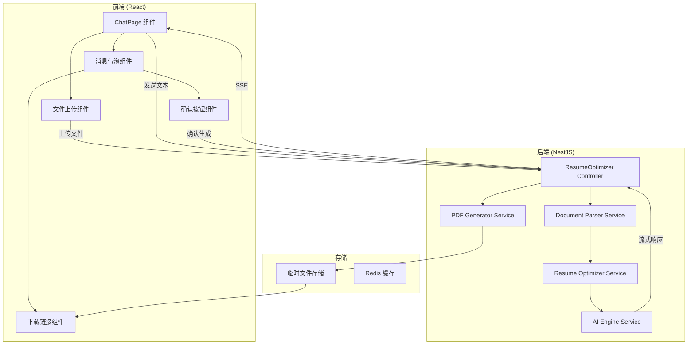

# 设计文档

## 概述

简历对话优化功能是一个基于现有聊天界面的简历优化流程。该功能允许用户通过直接输入文本或上传文件（PDF/Word）的方式提交简历内容，系统解析后调用大模型进行优化，并以 Markdown 格式流式输出优化结果，最终支持将优化后的简历导出为 PDF 文件。

本设计基于现有的技术栈：

- 前端：React + TypeScript + Ant Design X + Vite
- 后端：NestJS + Prisma + TypeScript
- AI 服务：已有的 AIEngineService（支持多 Provider 和流式输出）
- 文档解析：已有的 pdf-parse 和 mammoth 库

## 架构



## 组件和接口

### 后端组件

#### 1. ResumeOptimizerController

负责处理简历优化相关的 HTTP 请求（新增控制器，复用现有的简历上传接口）。

```typescript
@Controller('api/resume-optimizer')
export class ResumeOptimizerController {
  // 优化简历内容（流式输出）- 新增
  @Post('optimize')
  @Sse()
  async optimizeResume(
    @Body() body: { content: string },
    @Req() req: Request
  ): Observable<MessageEvent>;

  // 生成 PDF - 新增
  @Post('generate-pdf')
  async generatePDF(
    @Body() body: { markdown: string },
    @Req() req: Request
  ): Promise<{ downloadUrl: string; expiresAt: Date }>;

  // 下载 PDF - 新增
  @Get('download/:fileId')
  async downloadPDF(
    @Param('fileId') fileId: string,
    @Res() res: Response
  ): Promise<void>;
}
```

注意：简历上传和解析功能复用现有的 `ResumeController`（`/resumes/upload` 和 `/resumes/:id/parse`）。

#### 2. DocumentParserService（复用现有实现）

文档解析功能已在 `AIEngine.extractTextFromFile()` 中实现，支持 PDF、DOCX、TXT 等格式。

```typescript
// 现有实现位于 packages/backend/src/ai/ai.engine.ts
async extractTextFromFile(fileBuffer: Buffer, fileType: string): Promise<string>;
```

#### 3. ResumeOptimizerService（新增）

负责调用 AI 模型优化简历内容。

```typescript
@Injectable()
export class ResumeOptimizerService {
  // 流式优化简历
  async *optimizeResume(
    content: string,
    userId: string
  ): AsyncGenerator<string>;

  // 构建优化提示词
  private buildOptimizationPrompt(content: string): string;
}
```

#### 4. PDFGeneratorService

负责将 Markdown 内容转换为 PDF 文件。

```typescript
@Injectable()
export class PDFGeneratorService {
  // 生成 PDF 文件
  async generatePDF(markdown: string): Promise<{
    fileId: string;
    filePath: string;
    expiresAt: Date;
  }>;

  // 获取 PDF 文件路径
  async getPDFPath(fileId: string): Promise<string | null>;

  // 清理过期文件
  async cleanupExpiredFiles(): Promise<void>;
}
```

### 前端组件

#### 1. ResumeOptimizerChat

简历优化对话流程的主要组件。

```typescript
interface ResumeOptimizerChatProps {
  onOptimizationComplete?: (markdown: string) => void;
}

const ResumeOptimizerChat: React.FC<ResumeOptimizerChatProps> = (props) => {
  // 处理文本输入
  const handleTextSubmit = async (text: string) => {};

  // 处理文件上传
  const handleFileUpload = async (file: File) => {};

  // 处理流式响应
  const handleStreamResponse = async (response: Response) => {};

  // 处理 PDF 生成
  const handleGeneratePDF = async (markdown: string) => {};
};
```

#### 2. StreamingMarkdownBubble

支持流式渲染的 Markdown 消息气泡。

```typescript
interface StreamingMarkdownBubbleProps {
  content: string;
  isStreaming: boolean;
  onStreamComplete?: () => void;
}
```

#### 3. PDFDownloadCard

PDF 下载卡片组件。

```typescript
interface PDFDownloadCardProps {
  downloadUrl: string;
  expiresAt: Date;
  onRetry?: () => void;
}
```

### API 接口

#### 可复用的现有接口

| 接口     | 路径                              | 说明                          | 状态                              |
| -------- | --------------------------------- | ----------------------------- | --------------------------------- |
| 简历上传 | `POST /resumes/upload`            | 上传简历文件到存储服务        | ✅ 可直接复用                     |
| 简历解析 | `GET /resumes/:id/parse`          | 解析简历并提取结构化数据      | ✅ 可直接复用                     |
| 简历列表 | `GET /resumes`                    | 获取用户的所有简历            | ✅ 可直接复用                     |
| 简历详情 | `GET /resumes/:id`                | 获取单个简历详情              | ✅ 可直接复用                     |
| PDF 生成 | `POST /generate/pdf`              | 生成 PDF 文件                 | ⚠️ 需要完善（支持 Markdown 输入） |
| PDF 下载 | `GET /generate/pdfs/:id/download` | 下载 PDF 文件                 | ✅ 可直接复用                     |
| AI 调用  | `POST /ai/call`                   | 调用 AI 模型                  | ✅ 可直接复用                     |
| AI 流式  | `POST /ai/stream`                 | 流式调用 AI（当前仅返回提示） | ⚠️ 需要完善（实现真正的 SSE）     |

#### 需要完善的接口

##### 1. AI 流式接口完善

当前 `/ai/stream` 接口仅返回提示信息，需要实现真正的 SSE 流式输出。

```typescript
// 当前实现（需要完善）
@Post('stream')
async streamAI(@Body() request: CallAiDto): Promise<{ message: string }> {
  return { message: 'Streaming endpoint available via WebSocket or Server-Sent Events' };
}

// 完善后的实现
@Post('stream')
@Sse()
streamAI(
  @Body() request: CallAiDto,
  @Request() req: AuthRequest
): Observable<MessageEvent> {
  // 实现真正的 SSE 流式输出
}
```

##### 2. PDF 生成接口完善

当前 `/generate/pdf` 接口需要 `optimizationId`、`templateId` 和 `resumeData`，需要支持直接从 Markdown 生成 PDF。

```typescript
// 新增接口：从 Markdown 生成 PDF
@Post('pdf/from-markdown')
async generatePDFFromMarkdown(
  @Body() body: { markdown: string; options?: PDFOptions },
  @Request() req: any
): Promise<{ downloadUrl: string; expiresAt: Date }>;
```

#### 需要新增的接口

##### POST /api/resume-optimizer/optimize（新增）

简历内容优化接口，支持 SSE 流式输出。

请求：

```json
{
  "content": "简历文本内容"
}
```

响应（SSE）：

```
event: chunk
data: {"content": "# 个人简历\n\n"}

event: chunk
data: {"content": "## 基本信息\n"}

event: done
data: {"complete": true}
```

##### POST /generate/pdf/from-markdown（新增）

从 Markdown 内容直接生成 PDF。

请求：

```json
{
  "markdown": "# 个人简历\n\n## 基本信息\n...",
  "options": {
    "fontSize": 12,
    "margin": { "top": 20, "bottom": 20, "left": 20, "right": 20 }
  }
}
```

响应：

```json
{
  "downloadUrl": "/generate/pdfs/abc123/download",
  "expiresAt": "2026-01-10T12:00:00Z",
  "fileSize": 102400
}
```

### 流式输出实现方案

#### 技术选型：WebSocket

选择 WebSocket 的原因：

- 支持双向通信，便于后续扩展交互功能（如中断、重试）
- 更好的浏览器兼容性
- 可以实现更复杂的交互模式
- NestJS 通过 `@nestjs/websockets` 和 Socket.IO 提供完善支持

#### 后端 WebSocket Gateway 实现

```typescript
import {
  WebSocketGateway,
  WebSocketServer,
  SubscribeMessage,
  MessageBody,
  ConnectedSocket,
} from '@nestjs/websockets';
import { Server, Socket } from 'socket.io';

@WebSocketGateway({
  namespace: '/resume-optimizer',
  cors: { origin: '*' },
})
export class ResumeOptimizerGateway {
  @WebSocketServer()
  server: Server;

  constructor(
    private optimizerService: ResumeOptimizerService,
    private aiEngine: AIEngineService
  ) {}

  @SubscribeMessage('optimize')
  async handleOptimize(
    @MessageBody() data: { content: string; userId: string },
    @ConnectedSocket() client: Socket
  ) {
    try {
      const stream = this.optimizerService.optimizeResume(
        data.content,
        data.userId
      );

      for await (const chunk of stream) {
        client.emit('chunk', {
          type: 'chunk',
          content: chunk.content,
          timestamp: Date.now(),
        });
      }

      client.emit('done', { type: 'done', complete: true });
    } catch (error) {
      client.emit('error', {
        type: 'error',
        message: error instanceof Error ? error.message : 'Unknown error',
      });
    }
  }

  @SubscribeMessage('cancel')
  handleCancel(@ConnectedSocket() client: Socket) {
    // 支持取消正在进行的优化
    client.emit('cancelled', { type: 'cancelled' });
  }
}
```

#### ResumeOptimizerService 流式生成

```typescript
@Injectable()
export class ResumeOptimizerService {
  async *optimizeResume(
    content: string,
    userId: string
  ): AsyncGenerator<StreamChunk> {
    const prompt = this.buildOptimizationPrompt(content);

    // 调用 AI 引擎的流式接口
    const stream = this.aiEngine.stream(
      { model: '', prompt },
      userId,
      'resume-optimization'
    );

    let buffer = '';
    const CHUNK_SIZE = 300; // 每批次 200-500 字符

    for await (const chunk of stream) {
      buffer += chunk.content;

      // 按语义段落分批传输
      while (buffer.length >= CHUNK_SIZE) {
        const breakPoint = this.findSemanticBreakPoint(buffer, CHUNK_SIZE);
        const segment = buffer.slice(0, breakPoint);
        buffer = buffer.slice(breakPoint);

        yield {
          type: 'chunk',
          content: segment,
          timestamp: Date.now(),
        };
      }
    }

    // 输出剩余内容
    if (buffer.length > 0) {
      yield {
        type: 'chunk',
        content: buffer,
        timestamp: Date.now(),
      };
    }

    yield { type: 'done', complete: true };
  }

  // 寻找语义分割点（段落、句子结束）
  private findSemanticBreakPoint(text: string, minLength: number): number {
    // 优先在段落结束处分割
    const paragraphEnd = text.indexOf('\n\n', minLength);
    if (paragraphEnd !== -1 && paragraphEnd < minLength + 200) {
      return paragraphEnd + 2;
    }

    // 其次在句子结束处分割
    const sentenceEnds = ['。', '！', '？', '.', '!', '?', '\n'];
    for (const end of sentenceEnds) {
      const pos = text.indexOf(end, minLength);
      if (pos !== -1 && pos < minLength + 100) {
        return pos + 1;
      }
    }

    return minLength;
  }

  private buildOptimizationPrompt(content: string): string {
    return `请优化以下简历内容，保持核心信息不变，优化表达方式和格式，以 Markdown 格式输出：

${content}

要求：
1. 保留所有关键信息（姓名、联系方式、工作经历、教育背景等）
2. 使用专业的表达方式
3. 突出成就和量化结果
4. 使用清晰的 Markdown 格式
5. 适当使用项目符号和标题层级`;
  }
}
```

#### 前端 WebSocket 连接实现

```typescript
import { io, Socket } from 'socket.io-client';

const useStreamingOptimization = () => {
  const [content, setContent] = useState('');
  const [isStreaming, setIsStreaming] = useState(false);
  const [error, setError] = useState<string | null>(null);
  const socketRef = useRef<Socket | null>(null);

  const connect = useCallback(() => {
    if (socketRef.current?.connected) return;

    socketRef.current = io('/resume-optimizer', {
      transports: ['websocket'],
    });

    socketRef.current.on('chunk', (data: { content: string }) => {
      setContent((prev) => prev + data.content);
    });

    socketRef.current.on('done', () => {
      setIsStreaming(false);
    });

    socketRef.current.on('error', (data: { message: string }) => {
      setError(data.message);
      setIsStreaming(false);
    });

    socketRef.current.on('cancelled', () => {
      setIsStreaming(false);
    });
  }, []);

  const startOptimization = useCallback(
    (resumeContent: string, userId: string) => {
      connect();
      setIsStreaming(true);
      setContent('');
      setError(null);

      socketRef.current?.emit('optimize', {
        content: resumeContent,
        userId,
      });
    },
    [connect]
  );

  const cancelOptimization = useCallback(() => {
    socketRef.current?.emit('cancel');
  }, []);

  const disconnect = useCallback(() => {
    socketRef.current?.disconnect();
    socketRef.current = null;
  }, []);

  useEffect(() => {
    return () => disconnect();
  }, [disconnect]);

  return {
    content,
    isStreaming,
    error,
    startOptimization,
    cancelOptimization,
    disconnect,
  };
};
```

#### 前端动态内容追加组件

```typescript
const StreamingMarkdownBubble: React.FC<{
  content: string;
  isStreaming: boolean;
  onComplete?: () => void;
}> = ({ content, isStreaming, onComplete }) => {
  const containerRef = useRef<HTMLDivElement>(null);

  // 自动滚动到最新内容
  useEffect(() => {
    if (containerRef.current && isStreaming) {
      containerRef.current.scrollIntoView({
        behavior: 'smooth',
        block: 'end'
      });
    }
  }, [content, isStreaming]);

  // 流式完成回调
  useEffect(() => {
    if (!isStreaming && content && onComplete) {
      onComplete();
    }
  }, [isStreaming]);

  return (
    <div ref={containerRef} className="streaming-bubble">
      <ReactMarkdown remarkPlugins={[remarkGfm]}>
        {content}
      </ReactMarkdown>
      {isStreaming && (
        <span className="typing-indicator">
          <span className="dot" />
          <span className="dot" />
          <span className="dot" />
        </span>
      )}
    </div>
  );
};
```

## 数据模型

### ResumeOptimization

存储简历优化记录。

```typescript
interface ResumeOptimization {
  id: string;
  userId: string;
  originalContent: string;
  optimizedContent: string;
  pdfFileId?: string;
  status: 'pending' | 'optimizing' | 'completed' | 'failed';
  createdAt: Date;
  updatedAt: Date;
}
```

### TempFile

临时文件记录。

```typescript
interface TempFile {
  id: string;
  filePath: string;
  mimeType: string;
  expiresAt: Date;
  createdAt: Date;
}
```

## 正确性属性

_正确性属性是指在系统所有有效执行中都应该保持为真的特征或行为——本质上是关于系统应该做什么的形式化陈述。属性作为人类可读规范和机器可验证正确性保证之间的桥梁。_

### Property 1: 消息内容展示一致性

_对于任意_ 用户输入的文本内容或解析后的文档内容，该内容应该完整地展示在对话消息列表中，且内容不被修改或截断。

**Validates: Requirements 1.1, 1.4**

### Property 2: 文档解析内容提取

_对于任意_ 有效的 PDF 或 Word 文档，解析后提取的文本应该包含文档中的所有可见文本内容。

**Validates: Requirements 1.2, 1.3**

### Property 3: 简历优化信息保持

_对于任意_ 简历内容，优化后的结果应该保留原始简历中的核心信息（姓名、联系方式、工作经历标题、教育背景等关键字段）。

**Validates: Requirements 2.5**

### Property 4: 流式输出完整性

_对于任意_ 简历优化请求，流式输出的所有片段拼接后应该形成完整且有效的 Markdown 文档。

**Validates: Requirements 2.2**

### Property 5: PDF 生成有效性

_对于任意_ 有效的 Markdown 简历内容，生成的 PDF 文件应该是有效的 PDF 格式，且可以被标准 PDF 阅读器打开。

**Validates: Requirements 3.1**

### Property 6: 临时链接过期机制

_对于任意_ 生成的临时下载链接，在过期时间之前应该可以正常访问，过期后应该返回 404 或相应的错误状态。

**Validates: Requirements 3.6**

## 错误处理

### 文档解析错误

| 错误类型         | 错误码             | 处理方式                         |
| ---------------- | ------------------ | -------------------------------- |
| 不支持的文件格式 | UNSUPPORTED_FORMAT | 返回明确错误提示，列出支持的格式 |
| 文件过大         | FILE_TOO_LARGE     | 返回错误提示，说明文件大小限制   |
| 文件损坏         | FILE_CORRUPTED     | 返回错误提示，建议用户重新上传   |
| 解析超时         | PARSE_TIMEOUT      | 返回错误提示，建议用户稍后重试   |

### AI 优化错误

| 错误类型      | 错误码                 | 处理方式                       |
| ------------- | ---------------------- | ------------------------------ |
| AI 服务不可用 | AI_SERVICE_UNAVAILABLE | 重试 3 次后返回降级响应        |
| 内容过长      | CONTENT_TOO_LONG       | 返回错误提示，建议用户精简内容 |
| 流式连接中断  | STREAM_INTERRUPTED     | 自动重连或提示用户刷新         |

### PDF 生成错误

| 错误类型     | 错误码                | 处理方式                   |
| ------------ | --------------------- | -------------------------- |
| 生成失败     | PDF_GENERATION_FAILED | 返回错误提示，提供重试按钮 |
| 存储空间不足 | STORAGE_FULL          | 返回错误提示，通知管理员   |
| 文件已过期   | FILE_EXPIRED          | 返回 404，提示用户重新生成 |

## 测试策略

### 单元测试

- DocumentParserService：测试各种文件格式的解析
- ResumeOptimizerService：测试优化提示词构建
- PDFGeneratorService：测试 PDF 生成逻辑

### 属性测试

使用 fast-check 库进行属性测试：

- **Property 1**: 生成随机文本，验证消息展示一致性
- **Property 3**: 生成包含各种信息的简历，验证优化后信息保持
- **Property 4**: 验证流式输出片段的完整性
- **Property 5**: 生成随机 Markdown 内容，验证 PDF 有效性

### 集成测试

- 完整的简历优化流程测试
- 文件上传到 PDF 下载的端到端测试
- SSE 流式响应测试

### 测试配置

- 属性测试最少运行 100 次迭代
- 每个属性测试需要标注对应的设计文档属性编号
- 标签格式：**Feature: resume-chat-optimizer, Property {number}: {property_text}**
