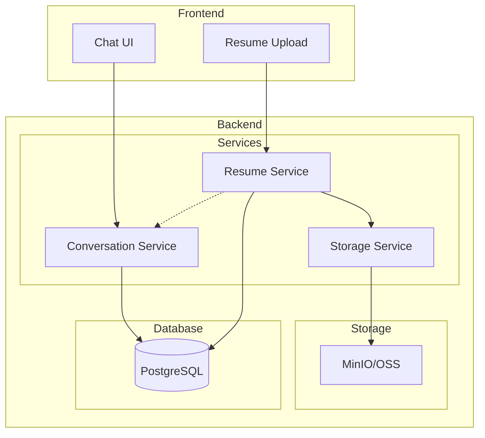
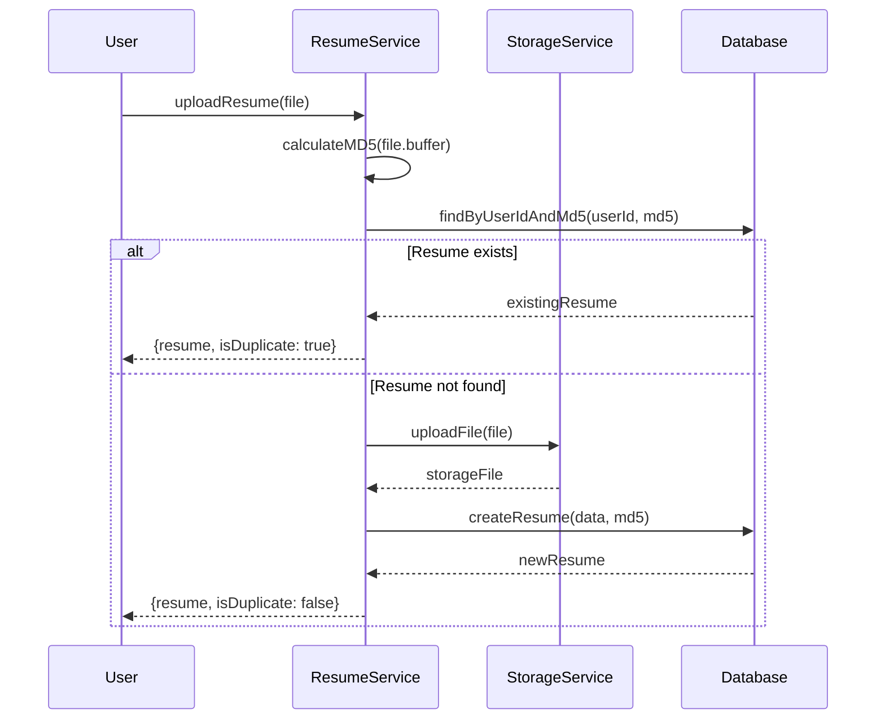

# Design Document: Resume Deduplication and Conversation Persistence

## Overview

本设计文档描述了简历去重和会话持久化功能的技术实现方案。系统将通过 MD5 哈希值检测重复简历上传，避免资源浪费，同时确保会话和消息可靠地持久化到 PostgreSQL 数据库。

### 核心目标

1. **简历去重**: 通过文件 MD5 哈希值检测重复上传，返回已存在的记录
2. **最新简历获取**: 支持自动获取用户最新的已解析简历进行优化
3. **会话持久化**: 确保所有会话和消息实时持久化到数据库
4. **数据关联**: 建立简历、优化结果与会话之间的关联关系

## Architecture



### 简历上传去重流程



## Components and Interfaces

### 1. Resume Service 扩展

```typescript
interface ResumeUploadResult {
  resume: Resume;
  isDuplicate: boolean;
  existingParsedContent?: ParsedResumeContent;
}

interface ParsedResumeContent {
  extractedText: string;
  structuredData: Record<string, any>;
  parsedAt: Date;
}

interface ResumeService {
  // 上传简历（带去重检测）
  uploadResume(
    userId: string,
    file: Express.Multer.File,
    title?: string,
    conversationId?: string
  ): Promise<ResumeUploadResult>;

  // 获取用户最新简历
  getLatestResume(userId: string): Promise<Resume | null>;

  // 获取用户最新已解析简历内容
  getLatestParsedContent(userId: string): Promise<ParsedResumeContent | null>;

  // 通过 MD5 查找简历
  findByMd5(userId: string, md5: string): Promise<Resume | null>;
}
```

### 2. Conversation Service 接口

```typescript
interface ConversationWithMessages {
  conversation: Conversation;
  messages: Message[];
  relatedResumes?: Resume[];
  relatedOptimizations?: Optimization[];
}

interface MessageMetadata {
  resumeId?: string;
  optimizationId?: string;
  action?: string;
  [key: string]: any;
}

interface ConversationService {
  // 创建会话
  createConversation(userId: string, title?: string): Promise<Conversation>;

  // 添加消息（带元数据）
  addMessage(
    conversationId: string,
    userId: string,
    role: MessageRole,
    content: string,
    metadata?: MessageMetadata
  ): Promise<Message>;

  // 获取会话及关联数据
  getConversationWithRelations(
    conversationId: string
  ): Promise<ConversationWithMessages>;

  // 添加优化结果消息
  addOptimizationResultMessage(
    conversationId: string,
    userId: string,
    resumeId: string,
    optimizationId: string,
    content: string
  ): Promise<Message>;
}
```

## Data Models

### Resume 模型扩展

```prisma
model Resume {
  id               String         @id @default(uuid())
  userId           String
  title            String
  originalFilename String?
  fileUrl          String?
  fileType         String?
  fileSize         Int?
  fileMd5          String?        // 新增: 文件 MD5 哈希值
  parsedData       Json?
  extractedText    String?        // 新增: 原始提取文本
  version          Int            @default(1)
  isPrimary        Boolean        @default(false)
  parseStatus      ParseStatus    @default(PENDING)
  conversationId   String?        // 新增: 关联的会话 ID
  createdAt        DateTime       @default(now())
  updatedAt        DateTime       @updatedAt

  user             User           @relation(fields: [userId], references: [id], onDelete: Cascade)
  optimizations    Optimization[]

  @@index([userId])
  @@index([userId, isPrimary])
  @@index([userId, fileMd5])  // 新增: 用于去重查询
  @@map("resumes")
}
```

### Message 元数据结构

```typescript
// Message.metadata JSON 结构
interface MessageMetadataSchema {
  // 简历相关
  resumeId?: string;
  resumeTitle?: string;

  // 优化相关
  optimizationId?: string;
  optimizationStatus?: string;

  // 操作类型
  action?:
    | 'resume_upload'
    | 'resume_parsed'
    | 'optimization_complete'
    | 'optimization_failed';

  // 附加信息
  [key: string]: any;
}
```

## Correctness Properties

_A property is a characteristic or behavior that should hold true across all valid executions of a system-essentially, a formal statement about what the system should do. Properties serve as the bridge between human-readable specifications and machine-verifiable correctness guarantees._

### Property 1: MD5 Hash Consistency

_For any_ file buffer, calculating the MD5 hash multiple times SHALL always produce the same hash value.

**Validates: Requirements 1.1**

### Property 2: Deduplication Correctness

_For any_ user and file, if a resume with the same MD5 hash already exists for that user, uploading the file again SHALL return the existing resume record and set isDuplicate to true.

**Validates: Requirements 1.2, 1.3**

### Property 3: New Resume Creation

_For any_ user and file with a unique MD5 hash (not existing for that user), uploading the file SHALL create a new resume record with the correct MD5 hash stored.

**Validates: Requirements 1.4, 1.5**

### Property 4: Latest Resume Priority

_For any_ user with multiple resumes, getLatestResume SHALL return the primary resume if one exists, otherwise the most recently updated resume with COMPLETED parse status.

**Validates: Requirements 2.1, 2.2, 2.3**

### Property 5: Parsed Content Persistence

_For any_ successfully parsed resume, the parsed content and extracted text SHALL be persisted to the database and retrievable.

**Validates: Requirements 3.1, 3.3**

### Property 6: Duplicate Returns Cached Content

_For any_ duplicate resume upload where the original has parsed content, the upload result SHALL include the previously parsed content.

**Validates: Requirements 3.2**

### Property 7: Version Increment on Update

_For any_ resume, updating the parsed content SHALL increment the version number by exactly 1.

**Validates: Requirements 3.4**

### Property 8: Conversation Persistence

_For any_ newly created conversation, it SHALL be immediately retrievable from the database with all required fields (userId, title, createdAt, isActive).

**Validates: Requirements 4.1, 4.2**

### Property 9: Message Persistence and Order

_For any_ conversation with messages, retrieving messages SHALL return them in chronological order (by createdAt ascending).

**Validates: Requirements 5.1, 5.2, 5.3**

### Property 10: Conversation Metadata Update

_For any_ message added to a conversation, the conversation's lastMessageAt SHALL be updated and messageCount SHALL increment by 1.

**Validates: Requirements 5.6**

### Property 11: Resume-Conversation Association

_For any_ resume uploaded with a conversationId, the conversationId SHALL be stored in the resume record and retrievable.

**Validates: Requirements 6.1**

### Property 12: Optimization Message Linking

_For any_ optimization result message, the message metadata SHALL contain valid resumeId and optimizationId references.

**Validates: Requirements 6.2, 6.3**

## Error Handling

### 简历上传错误

| 错误场景       | 错误码                 | 处理方式                     |
| -------------- | ---------------------- | ---------------------------- |
| 文件格式不支持 | INVALID_FILE_TYPE      | 返回 400，提示支持的格式     |
| 文件过大       | FILE_TOO_LARGE         | 返回 400，提示最大文件大小   |
| MD5 计算失败   | MD5_CALCULATION_FAILED | 记录日志，继续上传（不去重） |
| 存储服务失败   | STORAGE_ERROR          | 返回 500，提示稍后重试       |

### 会话操作错误

| 错误场景     | 错误码                 | 处理方式 |
| ------------ | ---------------------- | -------- |
| 会话不存在   | CONVERSATION_NOT_FOUND | 返回 404 |
| 无权限访问   | FORBIDDEN              | 返回 403 |
| 消息内容为空 | INVALID_MESSAGE        | 返回 400 |

## Testing Strategy

### 单元测试

- 测试 MD5 计算函数的正确性
- 测试去重逻辑的各种边界情况
- 测试最新简历获取的优先级逻辑
- 测试消息持久化和检索

### 属性测试 (Property-Based Testing)

使用 `fast-check` 库进行属性测试：

- **Property 1**: 生成随机 Buffer，验证 MD5 计算的一致性
- **Property 2-3**: 生成随机文件和用户，验证去重逻辑
- **Property 4**: 生成多个简历记录，验证优先级逻辑
- **Property 7**: 生成更新操作序列，验证版本递增
- **Property 9**: 生成消息序列，验证排序正确性
- **Property 10**: 生成消息添加操作，验证计数器更新

### 集成测试

- 测试完整的简历上传流程（包括去重）
- 测试会话创建和消息持久化流程
- 测试简历与会话的关联关系

### 测试配置

```typescript
// Property test configuration
const propertyTestConfig = {
  numRuns: 100, // 每个属性测试运行 100 次
  seed: Date.now(), // 可重现的随机种子
};
```
