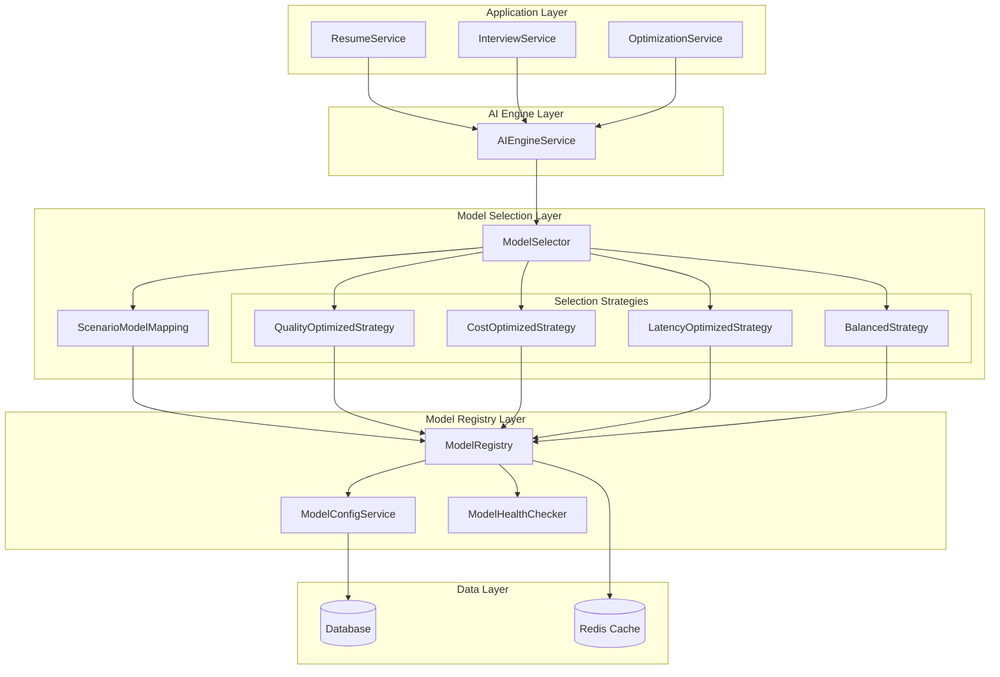
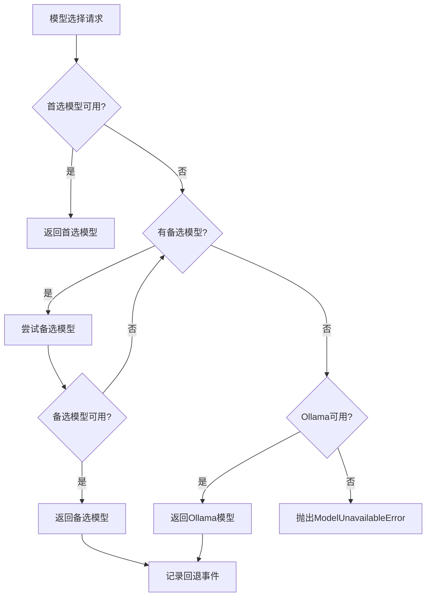

# Design Document: Smart Model Selector

## Overview

智能模型选择系统是AI简历优化平台的核心组件，负责根据不同应用场景自动选择最合适的开源AI模型。系统通过场景-模型映射配置、多维度选择策略（质量/成本/延迟）和智能回退机制，确保每个业务场景都能使用最优模型，同时平衡成本和性能。

## Architecture



## Components and Interfaces

### 1. ScenarioModelMapping (场景模型映射)

负责管理场景与推荐模型的映射关系。

```typescript
interface ScenarioConfig {
  scenario: ScenarioType;
  strategy: 'quality' | 'cost' | 'latency' | 'balanced';
  primaryModels: string[]; // 主推荐模型列表
  fallbackModels: string[]; // 备选模型列表
  weights: {
    quality: number; // 0-1
    cost: number; // 0-1
    latency: number; // 0-1
  };
  minQualityScore?: number; // 最低质量要求
  maxLatencyMs?: number; // 最大延迟要求
}

interface ScenarioModelMappingService {
  getScenarioConfig(scenario: ScenarioType): ScenarioConfig;
  updateScenarioConfig(
    scenario: ScenarioType,
    config: Partial<ScenarioConfig>
  ): void;
  getRecommendedModels(scenario: ScenarioType): ModelInfo[];
}
```

### 2. ModelRegistry (模型注册表)

管理所有可用模型的元数据和状态。

```typescript
interface OpenSourceModelInfo extends ModelInfo {
  family: 'qwen' | 'llama' | 'deepseek' | 'mistral' | 'other';
  parameterSize: string; // e.g., '7B', '72B'
  contextWindow: number; // 上下文窗口大小
  qualityRating: number; // 1-10 质量评级
  avgLatencyMs: number; // 平均延迟
  supportedFeatures: string[]; // 支持的特性
}

interface ModelRegistryService {
  registerModel(model: OpenSourceModelInfo): void;
  getModel(name: string): OpenSourceModelInfo | undefined;
  getModelsByFamily(family: string): OpenSourceModelInfo[];
  getAvailableModels(): OpenSourceModelInfo[];
  updateModelStatus(name: string, isAvailable: boolean): void;
  updateModelMetrics(name: string, metrics: ModelMetrics): void;
}
```

### 3. Enhanced Selection Strategies (增强选择策略)

#### QualityOptimizedStrategy 增强

```typescript
interface EnhancedQualityStrategy {
  // 基于实测的质量排名
  qualityRanking: Map<string, number>;

  // 选择最高质量模型
  selectModel(models: ModelInfo[], context: SelectionContext): ModelInfo;

  // 更新质量排名
  updateQualityRanking(modelName: string, score: number): void;
}
```

#### CostOptimizedStrategy 增强

```typescript
interface EnhancedCostStrategy {
  // 最低质量阈值
  minQualityThreshold: number;

  // 计算综合成本
  calculateTotalCost(model: ModelInfo, estimatedTokens: number): number;

  // 选择成本最优模型
  selectModel(models: ModelInfo[], context: SelectionContext): ModelInfo;
}
```

### 4. ModelSelector 增强

```typescript
interface EnhancedModelSelector {
  // 基于场景选择模型
  selectModelForScenario(
    scenario: ScenarioType,
    context?: SelectionContext
  ): ModelInfo;

  // 获取场景推荐模型列表
  getRecommendedModels(scenario: ScenarioType): ModelInfo[];

  // 执行回退选择
  selectWithFallback(
    scenario: ScenarioType,
    excludeModels: string[]
  ): ModelInfo;
}
```

## Data Models

### 场景模型映射配置

```typescript
// 默认场景配置
const DEFAULT_SCENARIO_CONFIGS: Record<ScenarioType, ScenarioConfig> = {
  [ScenarioType.RESUME_PARSING]: {
    scenario: ScenarioType.RESUME_PARSING,
    strategy: 'cost',
    primaryModels: ['Qwen2.5-7B-Instruct', 'Llama-3.2-3B-Instruct'],
    fallbackModels: ['DeepSeek-V2-Lite', 'Mistral-7B-Instruct'],
    weights: { quality: 0.3, cost: 0.5, latency: 0.2 },
    minQualityScore: 6,
  },

  [ScenarioType.RESUME_OPTIMIZATION]: {
    scenario: ScenarioType.RESUME_OPTIMIZATION,
    strategy: 'quality',
    primaryModels: [
      'Qwen2.5-72B-Instruct',
      'DeepSeek-V3',
      'Llama-3.1-70B-Instruct',
    ],
    fallbackModels: ['Qwen2.5-32B-Instruct', 'Llama-3.1-8B-Instruct'],
    weights: { quality: 0.6, cost: 0.2, latency: 0.2 },
    minQualityScore: 8,
  },

  [ScenarioType.INTERVIEW_QUESTION_GENERATION]: {
    scenario: ScenarioType.INTERVIEW_QUESTION_GENERATION,
    strategy: 'balanced',
    primaryModels: ['Qwen2.5-32B-Instruct', 'Llama-3.1-8B-Instruct'],
    fallbackModels: ['Mistral-7B-Instruct', 'Qwen2.5-7B-Instruct'],
    weights: { quality: 0.4, cost: 0.3, latency: 0.3 },
  },

  // 模拟面试对话 - 延迟优化
  [ScenarioType.AGENT_RESPONSE_PROCESSING]: {
    scenario: ScenarioType.AGENT_RESPONSE_PROCESSING,
    strategy: 'latency',
    primaryModels: ['Qwen2.5-7B-Instruct', 'Mistral-7B-Instruct'],
    fallbackModels: ['Llama-3.2-3B-Instruct'],
    weights: { quality: 0.2, cost: 0.2, latency: 0.6 },
    maxLatencyMs: 2000,
  },

  // 更多场景配置...
};
```

### 开源模型注册表

```typescript
const OPEN_SOURCE_MODELS: OpenSourceModelInfo[] = [
  // Qwen 系列
  {
    name: 'Qwen2.5-7B-Instruct',
    provider: 'qwen',
    family: 'qwen',
    parameterSize: '7B',
    contextWindow: 32768,
    costPerInputToken: 0.0001,
    costPerOutputToken: 0.0002,
    qualityRating: 7,
    avgLatencyMs: 800,
    latency: 800,
    successRate: 0.98,
    isAvailable: true,
    supportedFeatures: ['chat', 'function-calling'],
  },
  {
    name: 'Qwen2.5-32B-Instruct',
    provider: 'qwen',
    family: 'qwen',
    parameterSize: '32B',
    contextWindow: 32768,
    costPerInputToken: 0.0003,
    costPerOutputToken: 0.0006,
    qualityRating: 8,
    avgLatencyMs: 1500,
    latency: 1500,
    successRate: 0.97,
    isAvailable: true,
    supportedFeatures: ['chat', 'function-calling', 'reasoning'],
  },
  {
    name: 'Qwen2.5-72B-Instruct',
    provider: 'qwen',
    family: 'qwen',
    parameterSize: '72B',
    contextWindow: 32768,
    costPerInputToken: 0.0006,
    costPerOutputToken: 0.0012,
    qualityRating: 9,
    avgLatencyMs: 3000,
    latency: 3000,
    successRate: 0.96,
    isAvailable: true,
    supportedFeatures: ['chat', 'function-calling', 'reasoning', 'code'],
  },

  // Llama 系列
  {
    name: 'Llama-3.2-3B-Instruct',
    provider: 'meta',
    family: 'llama',
    parameterSize: '3B',
    contextWindow: 8192,
    costPerInputToken: 0.00005,
    costPerOutputToken: 0.0001,
    qualityRating: 6,
    avgLatencyMs: 500,
    latency: 500,
    successRate: 0.98,
    isAvailable: true,
    supportedFeatures: ['chat'],
  },
  {
    name: 'Llama-3.1-8B-Instruct',
    provider: 'meta',
    family: 'llama',
    parameterSize: '8B',
    contextWindow: 131072,
    costPerInputToken: 0.0001,
    costPerOutputToken: 0.0002,
    qualityRating: 7,
    avgLatencyMs: 900,
    latency: 900,
    successRate: 0.97,
    isAvailable: true,
    supportedFeatures: ['chat', 'function-calling'],
  },
  {
    name: 'Llama-3.1-70B-Instruct',
    provider: 'meta',
    family: 'llama',
    parameterSize: '70B',
    contextWindow: 131072,
    costPerInputToken: 0.0005,
    costPerOutputToken: 0.001,
    qualityRating: 9,
    avgLatencyMs: 2800,
    latency: 2800,
    successRate: 0.95,
    isAvailable: true,
    supportedFeatures: ['chat', 'function-calling', 'reasoning', 'code'],
  },

  // DeepSeek 系列
  {
    name: 'DeepSeek-V2-Lite',
    provider: 'deepseek',
    family: 'deepseek',
    parameterSize: '16B',
    contextWindow: 32768,
    costPerInputToken: 0.00008,
    costPerOutputToken: 0.00016,
    qualityRating: 7,
    avgLatencyMs: 700,
    latency: 700,
    successRate: 0.97,
    isAvailable: true,
    supportedFeatures: ['chat', 'code'],
  },
  {
    name: 'DeepSeek-V3',
    provider: 'deepseek',
    family: 'deepseek',
    parameterSize: '671B',
    contextWindow: 65536,
    costPerInputToken: 0.0004,
    costPerOutputToken: 0.0008,
    qualityRating: 9,
    avgLatencyMs: 2500,
    latency: 2500,
    successRate: 0.96,
    isAvailable: true,
    supportedFeatures: ['chat', 'function-calling', 'reasoning', 'code'],
  },

  // Mistral 系列
  {
    name: 'Mistral-7B-Instruct',
    provider: 'mistral',
    family: 'mistral',
    parameterSize: '7B',
    contextWindow: 32768,
    costPerInputToken: 0.0001,
    costPerOutputToken: 0.0002,
    qualityRating: 7,
    avgLatencyMs: 750,
    latency: 750,
    successRate: 0.98,
    isAvailable: true,
    supportedFeatures: ['chat', 'function-calling'],
  },
];
```

## Correctness Properties

_A property is a characteristic or behavior that should hold true across all valid executions of a system-essentially, a formal statement about what the system should do. Properties serve as the bridge between human-readable specifications and machine-verifiable correctness guarantees._

### Property 1: 场景配置完整性

_For any_ 已注册的场景类型，调用 `getScenarioConfig(scenario)` 应返回包含有效主推荐模型列表和备选模型列表的配置对象。

**Validates: Requirements 1.1, 1.2**

### Property 2: 配置权重有效性

_For any_ 场景配置的权重设置，quality + cost + latency 的权重值应在 [0, 1] 范围内，且三者之和应等于 1。

**Validates: Requirements 1.3**

### Property 3: 配置更新即时生效

_For any_ 场景配置更新操作，更新后立即调用模型选择应使用新配置的策略和模型列表。

**Validates: Requirements 1.4**

### Property 4: 模型属性存储完整性

_For any_ 注册的模型，存储后再读取应返回完全相同的属性值（名称、提供商、成本、延迟、质量评级等）。

**Validates: Requirements 2.2**

### Property 5: 模型状态切换一致性

_For any_ 模型状态切换操作（启用/禁用），切换后查询模型状态应返回新状态，且模型选择应遵循新状态。

**Validates: Requirements 2.3, 2.4**

### Property 6: 质量优化选择正确性

_For any_ 可用模型列表，质量优化策略应选择质量排名最高的可用模型；若最高质量模型不可用，应选择次高质量的可用模型。

**Validates: Requirements 3.2, 3.4**

### Property 7: 成本优化选择正确性

_For any_ 可用模型列表和质量阈值，成本优化策略应选择满足质量阈值的成本最低模型；若无模型满足阈值，应选择成本最低的模型。

**Validates: Requirements 4.1, 4.2, 4.3**

### Property 8: 延迟优化选择正确性

_For any_ 可用模型列表，延迟优化策略应选择延迟最低的可用模型。

**Validates: Requirements 5.1, 5.2**

### Property 9: 延迟阈值处理正确性

_For any_ 延迟阈值设置，若所有模型延迟超过阈值，策略应选择延迟最低的模型并记录警告。

**Validates: Requirements 5.3, 5.4**

### Property 10: 选择日志完整性

_For any_ 模型选择操作，选择日志应包含场景、选中模型、可用模型数量、使用的策略等完整信息。

**Validates: Requirements 7.1**

### Property 11: 统计数据正确性

_For any_ 一系列模型选择操作，按场景和按模型的统计数据应准确反映实际选择次数和分布。

**Validates: Requirements 7.2, 7.3, 7.4**

### Property 12: 回退链正确性

_For any_ 场景的模型选择，若首选模型不可用，应按配置的回退链顺序选择下一个可用模型；若所有配置模型不可用，应回退到本地 Ollama 模型。

**Validates: Requirements 8.1, 8.2, 8.3**

### Property 13: 回退事件记录正确性

_For any_ 模型回退事件，应记录回退原因、原模型、回退目标模型等信息。

**Validates: Requirements 8.4**

## Error Handling

### 1. 模型不可用错误

```typescript
class ModelUnavailableError extends AIError {
  constructor(
    public readonly modelName: string,
    public readonly scenario: ScenarioType,
    public readonly attemptedFallbacks: string[]
  ) {
    super(
      AIErrorCode.PROVIDER_UNAVAILABLE,
      `No available model for scenario ${scenario}. Attempted: ${attemptedFallbacks.join(', ')}`,
      undefined,
      true
    );
  }
}
```

### 2. 配置错误

```typescript
class InvalidScenarioConfigError extends Error {
  constructor(
    public readonly scenario: ScenarioType,
    public readonly reason: string
  ) {
    super(`Invalid configuration for scenario ${scenario}: ${reason}`);
  }
}
```

### 3. 错误处理流程



## Testing Strategy

### 单元测试

1. **ScenarioModelMapping 测试**
   - 测试所有场景类型的配置获取
   - 测试配置更新功能
   - 测试权重验证逻辑

2. **Selection Strategy 测试**
   - 测试质量优化策略的排名选择
   - 测试成本优化策略的成本计算和选择
   - 测试延迟优化策略的延迟选择
   - 测试平衡策略的综合评分

3. **ModelSelector 测试**
   - 测试场景到策略的映射
   - 测试回退链逻辑
   - 测试日志记录

### 属性测试

使用 `fast-check` 库进行属性测试：

1. **Property 6: 质量优化选择正确性**

   ```typescript
   // 生成随机模型列表，验证总是选择质量最高的可用模型
   fc.assert(
     fc.property(fc.array(arbitraryModelInfo, { minLength: 1 }), (models) => {
       const availableModels = models.filter((m) => m.isAvailable);
       if (availableModels.length === 0) return true;

       const selected = qualityStrategy.selectModel(models, context);
       const maxQuality = Math.max(
         ...availableModels.map((m) => m.qualityRating)
       );
       return selected.qualityRating === maxQuality;
     })
   );
   ```

2. **Property 7: 成本优化选择正确性**

   ```typescript
   // 生成随机模型列表和质量阈值，验证选择满足阈值的最低成本模型
   fc.assert(
     fc.property(
       fc.array(arbitraryModelInfo, { minLength: 1 }),
       fc.float({ min: 0, max: 10 }),
       (models, minQuality) => {
         const selected = costStrategy.selectModel(models, {
           minQualityScore: minQuality,
         });
         const qualifiedModels = models.filter(
           (m) => m.isAvailable && m.qualityRating >= minQuality
         );

         if (qualifiedModels.length === 0) {
           // 无满足条件的模型，应选择成本最低的
           const minCost = Math.min(
             ...models
               .filter((m) => m.isAvailable)
               .map((m) => m.costPerInputToken + m.costPerOutputToken)
           );
           return (
             selected.costPerInputToken + selected.costPerOutputToken ===
             minCost
           );
         }

         const minCostQualified = Math.min(
           ...qualifiedModels.map(
             (m) => m.costPerInputToken + m.costPerOutputToken
           )
         );
         return (
           selected.costPerInputToken + selected.costPerOutputToken ===
           minCostQualified
         );
       }
     )
   );
   ```

3. **Property 12: 回退链正确性**
   ```typescript
   // 验证回退链按顺序执行
   fc.assert(
     fc.property(
       arbitraryScenarioConfig,
       fc.array(fc.boolean()),
       (config, availabilities) => {
         // 设置模型可用性
         const models = [...config.primaryModels, ...config.fallbackModels];
         models.forEach((m, i) =>
           setModelAvailability(m, availabilities[i] ?? false)
         );

         const selected = selector.selectModelForScenario(config.scenario);

         // 验证选择了第一个可用的模型
         const firstAvailable = models.find(
           (m, i) => availabilities[i] ?? false
         );
         return (
           selected.name === firstAvailable || selected.provider === 'ollama'
         );
       }
     )
   );
   ```

### 集成测试

1. **端到端场景测试**
   - 测试简历解析场景的完整流程
   - 测试简历优化场景的完整流程
   - 测试模拟面试场景的完整流程

2. **回退机制测试**
   - 模拟主模型故障，验证回退行为
   - 模拟所有云端模型故障，验证 Ollama 回退

### 测试配置

```typescript
// jest.config.js
module.exports = {
  testMatch: [
    '**/ai-providers/selector/**/*.spec.ts',
    '**/ai-providers/selector/**/*.property.spec.ts',
  ],
  setupFilesAfterEnv: ['./test/setup-property-tests.ts'],
};

// 属性测试配置
// test/setup-property-tests.ts
import fc from 'fast-check';

fc.configureGlobal({
  numRuns: 100,
  verbose: true,
});
```
