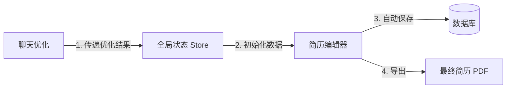

# IntervAI - 核心业务流程与交互逻辑深度分析报告

> **文档版本**: v2.0
> **更新日期**: 2026-01-14
> **更新人**: Senior Product Manager
> **状态**: 已更新 (基于当前代码库现状分析)

本报告基于对 `ai-resume` 项目源码的深度审计，详细梳理了当前的核心业务流程、交互逻辑，并诊断了现存的业务断点与技术瓶颈，提出了针对性的优化方案。

---

## 1. 核心业务流程分析 (Business Flow Analysis)

### 1.1 现状业务流程 (AS-IS Flow)

当前系统以 **Chat (对话)** 为核心交互界面，简历的上传、解析、优化及结果展示均在对话窗口中闭环完成。`ResumeBuilder` (简历编辑器) 目前作为一个独立的功能模块存在，尚未与主流程打通。

```mermaid
graph TD
    User((用户)) --> A[进入聊天页面 /chat]
    A --> B{是否已有会话?}
    B -- 否 --> C[创建新会话]
    B -- 是 --> D[加载历史消息]
    
    subgraph Resume Processing [简历处理全链路]
        E[点击上传简历] --> F[前端分片上传]
        F --> G[后端保存文件]
        G --> H[触发 Bull 队列任务]
        H --> I{解析是否成功?}
        I -- 否 --> J[触发自愈式解析 logic]
        J --> I
        I -- 是 --> K[WebSocket 推送: resume_parsed]
        K --> L[前端更新状态: 解析完成]
    end
    
    subgraph AI Optimization [AI 优化闭环]
        L --> M[自动/手动触发: optimize_resume]
        M --> N[AI 生成优化建议 & Markdown]
        N --> O[WebSocket 流式返回]
        O --> P[聊天气泡展示优化结果]
        P --> Q[提供下载/对比功能]
    end

    subgraph Standalone Editor [独立编辑器 (目前断连)]
        R[访问 /resume-builder] --> S[加载默认模版数据]
        S --> T[本地编辑 & 主题切换]
        T --> U[导出 JSON/Markdown]
    end

    A --> E
    P -.-> |断点: 缺少跳转| R
```

### 1.2 关键路径与依赖 (Critical Paths)

1.  **简历上传与解析 (Critical)**:
    *   **依赖**: `ResumeService` (NestJS), `Bull Queue` (Redis), `ChatGateway` (WebSocket).
    *   **时序**: 上传 (HTTP) -> 任务入队 -> 异步处理 -> Socket 通知。
    *   **风险**: 长时间解析可能导致前端 HTTP 请求超时 (120s)，需完全依赖 WebSocket 兜底通知。

2.  **实时通信链路 (Critical)**:
    *   **依赖**: `useChatSocket` (Frontend Hook) <-> `ChatGateway` (Backend).
    *   **机制**: 所有的进度更新 (`parsing` -> `optimizing` -> `finalizing`) 均依赖 Socket 消息。若连接断开，用户将丢失进度反馈。

---

## 2. 交互逻辑详细评估 (Interaction Logic Assessment)

### 2.1 聊天页面 (ChatPage) - 核心触点

*   **上传反馈**:
    *   *现状*: 使用 `localItems` 模拟临时消息气泡显示上传和解析进度。
    *   *体验*: 良好。通过 `AttachmentStatus` 实时更新进度条，消除了等待焦虑。
    *   *数据一致性*: 上传成功后，后端返回 `Resume` 对象，前端即时更新 `failedFiles` 映射以支持重试。

*   **AI 响应**:
    *   *现状*: 支持流式输出 (Streaming)，且包含结构化元数据 (`metadata`).
    *   *亮点*: 实现了 `StreamingMarkdownBubble`，在流式传输时即可渲染 Markdown，而非等待全部完成后渲染。
    *   *一致性*: `onDone` 事件触发后，前端强制刷新消息列表 (`loadMessages`) 以确保本地展示与数据库持久化数据一致。

### 2.2 简历编辑器 (ResumeBuilder) - 独立模块

*   **数据源**:
    *   *现状*: **完全本地化**。初始化使用 `DEFAULT_SECTIONS`，无后端数据加载逻辑。
    *   *交互*: 优秀的拖拽排序体验 (`framer-motion`), 实时 CSS 变量主题切换。
    *   *保存机制*: **缺失**。仅支持 `Ctrl+S` (打印日志) 和 导出文件。无云端同步。

---

## 3. 问题诊断与断点分析 (Gap Analysis)

经过代码审计，发现以下关键业务断点和潜在风险：

| 编号 | 问题类别 | 问题描述 | 严重等级 |
| :--- | :--- | :--- | :--- |
| **G01** | **业务流程断点** | **Chat 与 Builder 割裂**。用户在 Chat 中优化完简历后，无法一键跳转到编辑器进行精细排版。编辑器仅加载假数据，无法承接业务流。 | 🔴 **High** |
| **G02** | **数据持久化** | **编辑器无后端保存**。`ResumeBuilder` 的所有修改仅驻留内存，刷新即丢失，且无法同步回数据库。 | 🔴 **High** |
| **G03** | **异常处理** | **解析超时竞态**。前端设置了 120s 的 HTTP 超时，但后端队列处理可能超过此时间。虽有 Socket 兜底，但 Toast 提示"解析超时"可能误导用户以为失败。 | 🟡 Medium |
| **G04** | **代码一致性** | **自愈逻辑依赖**。前端 `ChatPage` 存在部分重试逻辑，但核心的 JSON 修复 (`attemptJsonFix`) 在后端。需确保后端修复失败后，前端能正确识别 `error` 状态并提示手动干预。 | 🟡 Medium |

---

## 4. 技术实现细节 (Technical Details)

### 4.1 自愈式解析 (Self-Healing Implementation)
位于 `packages/backend/src/ai/ai.engine.ts`，核心逻辑如下：
*   **JSON 提取**: 使用正则优先匹配 Markdown 代码块，其次匹配首尾 `{}`。
*   **智能修复 (`attemptJsonFix`)**:
    *   自动移除末尾多余逗号。
    *   转义非法控制字符 (`\n`, `\t`)。
    *   尝试为未加引号的 Key 补充引号。
*   **重试机制**: 解析失败时自动进行一次修复尝试，大幅提高了 AI 输出非标 JSON 时的容错率。

### 4.2 队列驱动的状态机
位于 `packages/backend/src/ai/queue/ai-queue.processor.ts`：
*   状态流转: `PROCESSING` -> `COMPLETED` / `FAILED`.
*   **关键机制**: 在 `parse` 和 `optimize` 的每个阶段，主动通过 `chatGateway` 发送系统消息。前端无需轮询，完全事件驱动。

---

## 5. 优化建议与演进计划 (Optimization Plan)

### 5.1 短期修复 (v2.1) - 连通业务孤岛

1.  **打通 Chat -> Builder 路径**:
    *   在 `ChatPage` 的优化结果卡片中，增加 "Open in Editor" 按钮。
    *   点击后通过 `react-router` 跳转 `/resume-builder`，并通过 `location.state` 或 `Zustand Store` 传递优化后的 Markdown/JSON 数据。

2.  **改造 ResumeBuilder 数据源**:
    *   修改 `ResumeBuilder.tsx`，使其优先从 Store 或 Props 读取数据，而非使用 `DEFAULT_SECTIONS`。
    *   增加简单的解析器，将 Markdown 转换为 Section 数组结构。

### 5.2 中期演进 (v2.2) - 数据闭环

1.  **实现云端保存**:
    *   后端新增 `PATCH /resumes/:id/content` 接口，接收 JSON 结构的 Section 数据。
    *   前端实现自动保存 (Auto-save) 和手动保存逻辑。

2.  **统一状态管理**:
    *   引入 `useResumeEditorStore` (Zustand)，将编辑器的状态从组件级提升为应用级，便于跨页面共享数据。

### 5.3 流程图更新 (TO-BE Flow)



---

## 6. 版本变更记录

| 版本 | 日期 | 修改人 | 变更内容 |
| :--- | :--- | :--- | :--- |
| v1.0 | 2024-01-01 | PM | 初始版本，定义基本上传流程 |
| v2.0 | 2026-01-14 | Senior PM | 基于代码审计重构文档，识别 Chat-Builder 断点，完善技术细节 |
