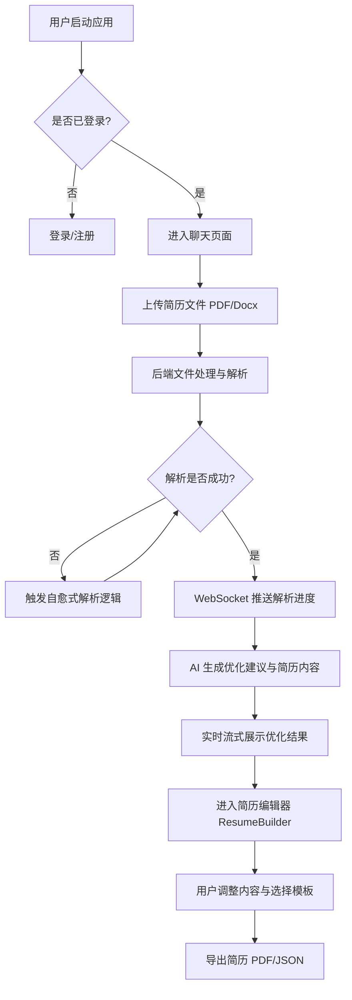
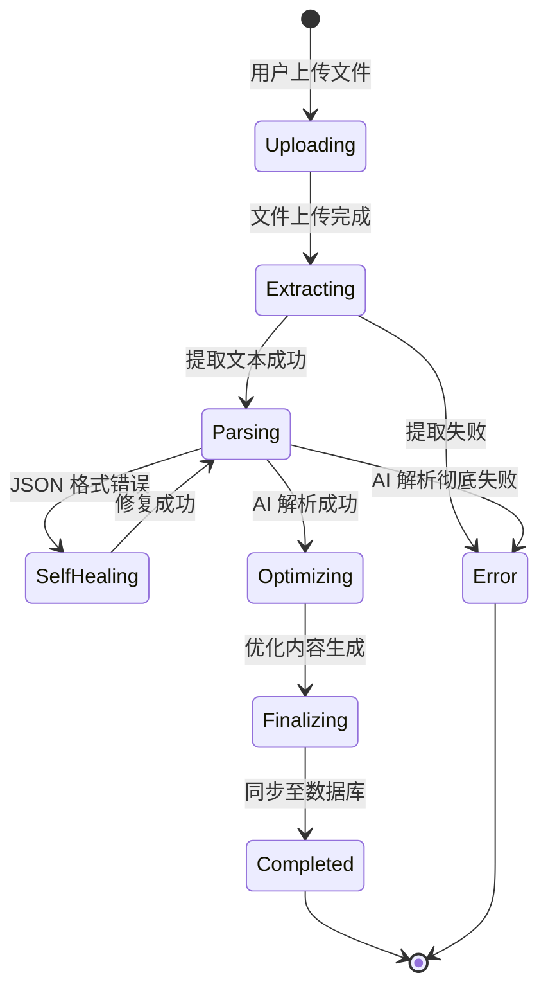

# AI Resume Optimizer - 核心业务流程与交互逻辑文档

本报告详细梳理了 AI Resume Optimizer 的核心业务流程、交互逻辑以及本次优化的技术细节。

## 1. 核心业务流程 (Core Business Flow)

### 1.1 简历优化全链路流程图

### 1.2 简历解析状态转换图

---

## 2. 交互逻辑详细说明

### 2.1 简历上传与实时反馈
- **用户路径**: 在聊天窗口点击上传按钮或拖拽文件。
- **系统响应**: 
    1. 立即显示上传进度条（前端模拟）。
    2. 文件上传至服务器后，后端通过 Bull 队列启动异步解析任务。
    3. **优化点**: 引入 WebSocket 进度通知，前端 `ChatPage` 实时显示“提取文字”、“识别技能”、“润色描述”等具体阶段，消除用户的“黑盒”焦虑。
- **异常处理**: 若上传失败或格式不支持，弹出 Toast 提醒并允许用户重新上传。

### 2.2 简历编辑器 (ResumeBuilder)
- **用户路径**: 解析完成后，点击“进入编辑器”。
- **系统响应**: 
    1. 加载优化后的简历数据。
    2. 提供侧边栏导航，支持通过拖拽（Reorder）调整简历章节顺序。
    3. **优化点**: 增加**多模板个性化切换**，通过 CSS 变量驱动，一键切换 Modern、Minimal、Emerald、Royal 等不同视觉风格。
- **交互细节**: 支持快捷键（Cmd+S 保存，Cmd+P 预览），实时预览窗口支持桌面/平板/移动端适配切换。

---

## 3. 技术优化点总结

### 3.1 自愈式解析 (Self-Healing Parsing)
- **现状**: AI 有时会生成非法的 JSON 格式，导致前端解析失败。
- **方案**: 
    - 在 `ai.engine.ts` 中集成 `zod` 架构验证。
    - 引入基于规则的 JSON 修复逻辑（`attemptJsonFix`），处理常见的逗号、特殊字符和换行符问题。
    - 若验证失败，系统会自动尝试修复并重新校验，确保数据结构的健壮性。

### 3.2 进度详情增强
- **实现**: 
    - 后端 `AIQueueProcessor` 在解析的各个关键节点（提取、解析、优化、完成）通过 `ChatGateway` 发送系统消息。
    - 前端 `useChatSocket` 监听 `onSystem` 事件，动态更新 `AttachmentStatus`，实现精细化的进度展示。

### 3.3 CSS 变量驱动的多模板系统
- **设计**: 在 `ResumeBuilder.tsx` 中定义 `ResumeTheme` 接口，通过控制 `--resume-primary`, `--resume-bg`, `--resume-text` 等 CSS 变量，实现了极低成本的视觉风格多样化。

---

## 4. 潜在问题与进一步建议
1. **多语言支持**: 当前模板对中文字体的适配可进一步优化，建议引入 Google Fonts 的 Noto Sans SC。
2. **导出性能**: 复杂的 CSS 变量在导出 PDF 时可能存在兼容性问题，建议在导出阶段使用无头浏览器（如 Puppeteer）进行服务端渲染。
3. **协作功能**: 未来可以增加“分享链接”功能，允许用户将生成的简历链接发送给 HR 或朋友点评。
