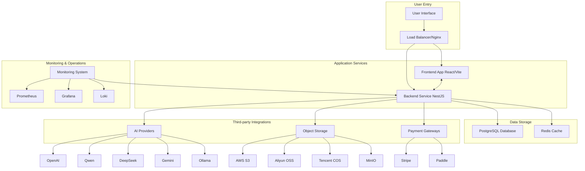

# Resume Optimizer Platform

AI-powered resume optimization SaaS platform that helps job seekers improve their resumes using advanced AI algorithms.

## Table of Contents

- [Overview](#overview)
- [Key Features](#key-features)
- [Technology Stack](#technology-stack)
- [Architecture](#architecture)
- [Detailed Architecture Diagram](#detailed-architecture-diagram)
- [Project Structure](#project-structure)
- [Getting Started](#getting-started)
- [Development](#development)
- [Testing](#testing)
- [Deployment](#deployment)
- [API Documentation](#api-documentation)
- [License](#license)

## Overview

Resume Optimizer is a comprehensive SaaS platform designed to help job seekers enhance their resumes using artificial intelligence. The platform analyzes resumes against job descriptions, provides targeted improvement suggestions, generates optimized content, and creates professional PDF documents. With support for multiple AI providers and a complete subscription system, it offers a scalable solution for career advancement.

## Key Features

### Full Interview Process Guidance
- Personalized interview preparation plan
- Interview skills training and advice
- Interview progress tracking and feedback
- Interview performance analysis and improvement suggestions

### Self-Introduction Optimization
- Customized self-introduction based on target position
- Personalized opening statement generation
- Language expression optimization and polishing
- Self-introduction templates for different scenarios

### AI-Powered Resume Analysis
- Intelligent parsing of resumes in various formats (PDF, DOCX, TXT)
- Detailed analysis of resume content against job descriptions
- Match scoring with breakdown by skills, experience, education, and keywords
- Actionable suggestions for improvement

### Multi-Provider AI Support
- Support for major AI providers: OpenAI, Qwen, DeepSeek, Gemini, and Ollama
- Automatic model selection based on performance and availability
- Built-in fallback mechanisms for high availability
- Usage tracking and cost monitoring

### Resume Optimization
- Content enhancement suggestions
- Keyword optimization for applicant tracking systems (ATS)
- Structure improvements for better readability
- Quantification of achievements

### Professional Document Generation
- Multiple premium templates for resume presentation
- Customizable PDF generation options
- Cover letter generation capabilities
- Professional formatting and design

### Interview Question Prediction and Answers
- AI-generated interview questions based on resume and job
- Behavioral, technical, and situational questions
- Suggested answers and tips for common questions
- Practice interview sessions

### One-on-One Mock Interviews
- Real-time video mock interviews
- AI interviewer functionality
- Interview session recording and playback
- Personalized feedback and scoring

### Subscription & Payment System
- Tiered subscription plans (Free, Pro, Enterprise)
- Integration with Stripe and Paddle payment processors
- Usage quotas based on subscription tier
- Flexible billing periods (monthly/yearly)

### Advanced Features
- Real-time chat interface for interactive assistance
- Resume versioning and history tracking
- Job tracking and application management
- Performance monitoring and analytics

## Technology Stack

### Backend
- **Framework**: [NestJS](https://nestjs.com/) - Progressive Node.js framework
- **Language**: [TypeScript](https://www.typescriptlang.org/) - Typed JavaScript
- **Database**: [PostgreSQL](https://www.postgresql.org/) with [Prisma ORM](https://www.prisma.io/)
- **Caching**: [Redis](https://redis.io/) - In-memory data structure store
- **Authentication**: JWT with Passport.js
- **AI Providers**: OpenAI, Qwen, DeepSeek, Gemini, Ollama
- **File Storage**: AWS S3, Aliyun OSS, Tencent COS, MinIO
- **Logging**: Winston with structured JSON logging
- **API Documentation**: Swagger/OpenAPI with NestJS Swagger
- **Validation**: class-validator and class-transformer
- **Testing**: Jest for unit and integration tests
- **Containerization**: Docker and Docker Compose
- **Monitoring**: Prometheus, Grafana, Loki for metrics and logs

### Frontend
- **Framework**: [React 18](https://reactjs.org/) with [Vite](https://vitejs.dev/)
- **Language**: TypeScript
- **UI Library**: [Ant Design 5](https://ant.design/)
- **State Management**: [Zustand](https://github.com/pmndrs/zustand)
- **Routing**: React Router v6
- **HTTP Client**: Axios
- **Testing**: Vitest with React Testing Library
- **Build Tool**: Vite with Rollup
- **Progressive Web App**: Workbox for offline support

## Architecture

The platform follows a modern microservices-inspired architecture within a monorepo:

```
┌─────────────────┐    ┌──────────────────┐
│   Frontend      │    │   Load Balancer  │
│   (React/Vite)  │◄──►│   (Nginx)        │
└─────────────────┘    └─────────┬────────┘
                                 │
                    ┌────────────┼────────────┐
                    │   Backend  │            │
                    │  (NestJS)  │            │
                    └─────┬──────┘            │
                          │                   │
             ┌────────────┼────────────┐      │
             │ PostgreSQL │   Redis    │      │
             │ (Primary   │ (Caching/  │◄─────┘
             │  Storage)  │  Sessions) │
             └────────────┴────────────┘
```

### Backend Architecture
- Modular design with feature-based modules
- Clean separation of concerns with services, controllers, and DTOs
- Event-driven processing with Bull queues
- Comprehensive error handling and logging
- Security best practices (helmet, CORS, rate limiting)

### Data Flow
1. User uploads resume and enters job description
2. System parses documents using AI
3. AI engine compares resume with job requirements
4. Detailed analysis and suggestions are generated
5. User can accept/reject suggestions
6. Optimized resume is generated in PDF format
7. Interview questions are prepared based on content

## Detailed Architecture Diagram



## Project Structure

This is a monorepo containing:

```
.
├── packages
│   ├── backend                 # NestJS backend service
│   │   ├── prisma              # Database schema and migrations
│   │   ├── src
│   │   │   ├── ai              # Core AI engine
│   │   │   ├── ai-providers    # Multi-AI provider support
│   │   │   ├── common          # Shared utilities and helpers
│   │   │   ├── conversation    # Chat functionality
│   │   │   ├── generate        # PDF generation
│   │   │   ├── interview       # Interview preparation
│   │   │   ├── job             # Job management
│   │   │   ├── optimization    # Resume optimization
│   │   │   ├── payment         # Payment processing
│   │   │   ├── quota           # Usage quotas
│   │   │   ├── resume          # Resume management
│   │   │   ├── storage         # File storage abstraction
│   │   │   ├── user            # User management
│   │   │   └── ...             # Other modules
│   │   └── ...
│   └── frontend                # React + Vite frontend application
│       ├── src
│       │   ├── components      # Reusable UI components
│       │   ├── pages           # Page components
│       │   ├── services        # API service layer
│       │   ├── stores          # Zustand state management
│       │   └── ...             # Other frontend code
│       └── ...
├── deployment                  # Production deployment configs
├── config                      # Configuration files
└── scripts                     # Utility scripts
```

## Getting Started

### Prerequisites

- Node.js >= 18.0.0
- pnpm >= 9.0.0 (recommended) or npm >= 9.0.0
- PostgreSQL 15+
- Redis 7+
- Docker (optional, for containerized deployment)

> 💡 We recommend using pnpm as the package manager for this project. It provides better disk space efficiency and faster installation times compared to npm or yarn.

### Installation

1. Clone the repository:
```bash
git clone <repository-url>
cd resume-optimizer
```

2. Install dependencies using pnpm (recommended):
```bash
pnpm install
```

Or using npm:
```bash
npm install
```

### Environment Configuration

Copy and configure environment files:

```bash
# Backend
cp packages/backend/.env.example packages/backend/.env
# Edit with your database, Redis, and AI provider settings

# Frontend
cp packages/frontend/.env.example packages/frontend/.env
# Edit with your API endpoint and other settings
```

### Database Setup

```bash
# Generate Prisma client
cd packages/backend
pnpm prisma:generate

# Run database migrations
pnpm prisma:migrate

# (Optional) Seed initial data
pnpm prisma:seed
```

## Development

### Running the Application

```bash
# Run both frontend and backend in development mode using pnpm (recommended)
pnpm dev

# Or run individually
pnpm dev:backend
pnpm dev:frontend
```

The application will be available at:
- Frontend: http://localhost:5173
- Backend API: http://localhost:3000
- Swagger Docs: http://localhost:3000/api/docs

### Available Scripts

- `pnpm dev` - Start both frontend and backend in development mode (recommended)
- `pnpm build` - Build both packages for production
- `pnpm test` - Run tests in all packages
- `pnpm lint` - Lint all packages
- `pnpm format` - Format code with Prettier
- `pnpm clean` - Clean build artifacts and dependencies

## Testing

### Backend Testing

```bash
cd packages/backend

# Run all tests
pnpm test

# Run tests in watch mode
pnpm test:watch

# Generate coverage report
pnpm test:cov
```

### Frontend Testing

```bash
cd packages/frontend

# Run all tests
pnpm test

# Run tests in watch mode
pnpm test:watch
```

## Deployment

### Docker Deployment (Recommended)

#### Development

```bash
docker-compose up -d
```

#### Production

```bash
docker-compose -f docker-compose.prod.yml up -d
```

### Manual Deployment

1. Build the applications:
```bash
pnpm build
```

2. Set up environment variables for production:
```bash
cp .env.production .env.production.local
# Edit .env.production.local with production settings
```

3. Start the services:
```bash
# Backend
cd packages/backend
pnpm start:prod

# Frontend (serve the built files with a web server like Nginx)
```

### Production Features

- ✅ PostgreSQL with SSL/TLS encryption
- ✅ Redis with password authentication
- ✅ Multi-cloud object storage support (AWS S3, Aliyun OSS, etc.)
- ✅ Nginx load balancer with SSL termination
- ✅ Automated daily backups
- ✅ Health checks and monitoring
- ✅ Rate limiting and security headers
- ✅ Horizontal scaling support
- ✅ Containerized deployment with Docker

### Production Monitoring

The platform includes comprehensive monitoring capabilities:
- Application metrics with Prometheus
- Centralized logging with Loki
- Visualization dashboards with Grafana
- Real-time log aggregation with Promtail

## API Documentation

Once the backend is running, detailed API documentation is available through Swagger UI:
- http://localhost:3000/api/docs (development)
- https://your-domain.com/api/docs (production)

The API follows RESTful principles and includes:
- Comprehensive endpoint documentation
- Request/response schemas
- Interactive testing interface
- Authentication flow explanations

## License

Private
