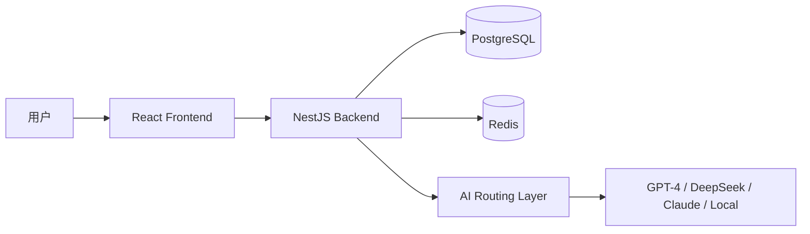

# 🚀 AI Resume Optimizer | 智能简历优化平台

<p align="center">
  
</p>

<p align="center">
  <strong>基于大模型驱动的智能化简历优化 SaaS 平台，助力求职者精准匹配，大幅提升面试率。</strong>
</p>

<p align="center">
  <a href="https://github.com/yiying/ai-resume/actions/workflows/ci.yml">
    
  </a>
  <a href="https://opensource.org/licenses/MIT">
    
  </a>
  <a href="https://nodejs.org/">
    
  </a>
  <a href="https://pnpm.io/">
    
  </a>
  <a href="https://github.com/yiying/ai-resume/pulls">
    
  </a>
</p>

---

## 📖 项目简介

**AI Resume Optimizer** 是一款革命性的简历优化工具。它利用先进的自然语言处理（NLP）技术和大语言模型（LLM），为求职者提供从简历解析、匹配度分析、内容润色到模拟面试的全流程支持。

> **为什么选择 AI Resume Optimizer？**
> 在竞争激烈的就业市场中，一份针对性强、符合 ATS 扫描规则的简历是敲开面试大门的关键。本项目通过 AI 技术消除简历与职位描述（JD）之间的信息差，让你的优势脱颖而出。

---

## ✨ 核心特性

### 🔍 智能简历分析
- **深度解析**：支持 PDF, DOCX, TXT 格式，精准提取个人信息、工作经历与技能栈。
- **JD 匹配引擎**：基于向量相似度与语义分析，量化简历与职位的匹配百分比。
- **缺失关键词识别**：自动识别简历中缺少的关键技术词汇，提升 ATS 通过率。

### 🤖 强大的 AI 驱动
- **多模型支持**：无缝集成 OpenAI (GPT-4), Qwen (通义千问), DeepSeek, Gemini, 以及本地部署的 Ollama。
- **智能工作流 (LCEL)**：基于 LangChain Expression Language 构建的高可靠性 AI 处理流水线。
- **自愈式解析**：内置自动修复逻辑，确保 AI 输出的结构化数据 100% 准确。

### ✍️ 简历优化
- **成果量化建议**：AI 辅助将平铺直叙的描述转化为具有说服力的量化成果。
- **多行业模板**：内置多套符合现代审美与专业标准的简历模板，支持一键导出 PDF。

### 🎭 面试全链路加速
- **面试预测**：根据简历内容与职位要求，生成针对性的面试题库。
- **模拟面试**：沉浸式 AI 对话，实时评分并提供专业改进反馈。

---

## 📸 功能演示

<p align="center">
  <em>(此处可添加项目演示 GIF 或 截图)</em>
</p>

---

## 🛠️ 技术架构

### 核心技术栈
- **后端**: [NestJS](https://nestjs.com/) + [TypeScript](https://www.typescriptlang.org/)
- **数据库**: [PostgreSQL](https://www.postgresql.org/) + [Prisma ORM](https://www.prisma.io/)
- **缓存/消息**: [Redis](https://redis.io/) + BullMQ
- **AI 框架**: [LangChain](https://js.langchain.com/) (LCEL, Agents, Tools)
- **前端**: [React 18](https://reactjs.org/) + [Vite](https://vitejs.dev/) + [Ant Design 5](https://ant.design/)

### 系统架构图


---

## 🚀 快速上手

### 环境准备
- Node.js >= 18
- pnpm >= 9
- PostgreSQL & Redis

### 快速启动
1. **克隆并安装**
   ```bash
   git clone https://github.com/yiying/ai-resume.git
   cd ai-resume
   pnpm install
   ```
2. **配置环境变量**
   ```bash
   cp packages/backend/.env.example packages/backend/.env
   # 编辑 .env 并填入数据库及 AI API Key
   ```
3. **初始化数据库**
   ```bash
   pnpm --filter backend prisma:migrate
   ```
4. **启动开发环境**
   ```bash
   pnpm dev
   ```

访问 [http://localhost:5173](http://localhost:5173) 开始优化你的简历！

---

## 🤝 参与贡献

我们非常期待你的加入！无论是修复 Bug、完善文档还是提出新功能建议。

- 详细指南：[CONTRIBUTING.md](./CONTRIBUTING.md)
- 提交 Issue：[Issue Tracker](https://github.com/yiying/ai-resume/issues)
- 提交 PR：[Pull Request Guide](https://github.com/yiying/ai-resume/pulls)

---

## 📄 许可证

本项目采用 [MIT License](./LICENSE) 开源协议。

---

## 🌟 Star 趋势

[](https://github.com/yiying/ai-resume/stargazers)

---

<p align="center">
  如果您觉得这个项目有帮助，请给它一个 ⭐️！这对我非常重要。
</p>

#Tags: #AI #Resume #NestJS #React #LangChain #DeepSeek #JobHunt #Career #OpenSource
