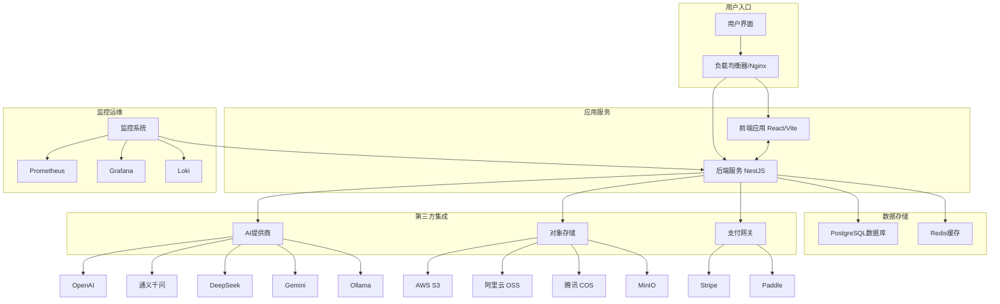

# 简历优化平台

基于人工智能的简历优化 SaaS 平台，帮助求职者使用先进的人工智能算法改进他们的简历。

## 目录

- [概述](#概述)
- [核心功能](#核心功能)
- [技术栈](#技术栈)
- [系统架构](#系统架构)
- [详细架构图](#详细架构图)
- [项目结构](#项目结构)
- [入门指南](#入门指南)
- [开发](#开发)
- [测试](#测试)
- [部署](#部署)
- [API 文档](#api-文档)
- [许可证](#许可证)

## 概述

简历优化器是一个全面的 SaaS 平台，旨在帮助求职者利用人工智能增强简历。该平台可以分析简历与职位描述的匹配度，提供有针对性的改进建议，生成优化内容，并创建专业的 PDF 文档。凭借对多家 AI 提供商的支持和完整的订阅系统，它为职业发展提供了可扩展的解决方案。

## 核心功能

### 全流程面试指导
- 个性化面试准备计划
- 面试技巧培训和建议
- 面试进度跟踪和反馈
- 面试表现分析和改进建议

### 简历优化
- 根据目标职位深度优化个人简介和核心内容
- 个性化开场白和自我介绍生成
- 语言表达优化和润色
- 简历内容增强和 ATS 关键词优化

### AI驱动的简历分析
- 智能解析多种格式的简历 (PDF, DOCX, TXT)
- 详细分析简历内容与职位描述的匹配度
- 按技能、经验、教育背景和关键词进行匹配评分
- 可操作的改进建议

### 多AI提供商支持
- 支持主流AI提供商：OpenAI、通义千问、DeepSeek、Gemini 和 Ollama
- 基于性能和可用性的自动模型选择
- 内置故障转移机制以确保高可用性
- 使用情况跟踪和成本监控

### 职位输入
- 智能解析职位描述 (JD) 内容
- 自动提取关键词、技能要求和加分项
- 支持从文本或 URL 快速输入职位信息

### 专业文档生成
- 多种优质模板供简历展示
- 可自定义的 PDF 生成选项
- 求职信生成功能
- 专业格式和设计

### 面试预测
- 基于简历和职位的 AI 生成面试问题库
- 行为、技术和情景问题分类
- 常见问题的建议答案和提示
- 面试对策和准备计划

### 模拟面试
- AI 面试官实时互动，模拟真实面试场景
- 实时反馈、评分和改进建议
- 不同面试官风格和重点领域设置

### 订阅和支付系统
- 分层订阅计划 (免费版、专业版、企业版)
- 与 Stripe 和 Paddle 支付处理器集成
- 基于订阅级别的使用配额
- 灵活的计费周期 (月付/年付)

### 高级功能
- 实时聊天界面进行交互式辅助
- 简历版本控制和历史跟踪
- 职位跟踪和申请管理
- 性能监控和分析

## 技术栈

### 后端
- **框架**: [NestJS](https://nestjs.com/) - 渐进式 Node.js 框架
- **语言**: [TypeScript](https://www.typescriptlang.org/) - 类型化的 JavaScript
- **数据库**: [PostgreSQL](https://www.postgresql.org/) 与 [Prisma ORM](https://www.prisma.io/)
- **缓存**: [Redis](https://redis.io/) - 内存数据结构存储
- **认证**: JWT 与 Passport.js
- **AI 提供商**: OpenAI、通义千问、DeepSeek、Gemini、Ollama
- **文件存储**: AWS S3、阿里云 OSS、腾讯 COS、MinIO
- **日志**: Winston 结构化 JSON 日志
- **API 文档**: Swagger/OpenAPI 与 NestJS Swagger
- **验证**: class-validator 和 class-transformer
- **测试**: Jest 单元和集成测试
- **容器化**: Docker 和 Docker Compose
- **监控**: Prometheus、Grafana、Loki 用于指标和日志

### 前端
- **框架**: [React 18](https://reactjs.org/) 与 [Vite](https://vitejs.dev/)
- **语言**: TypeScript
- **UI 库**: [Ant Design 5](https://ant.design/)
- **状态管理**: [Zustand](https://github.com/pmndrs/zustand)
- **路由**: React Router v6
- **HTTP 客户端**: Axios
- **测试**: Vitest 与 React Testing Library
- **构建工具**: Vite 与 Rollup
- **渐进式 Web 应用**: Workbox 离线支持

## 系统架构

该平台采用现代化的微服务启发式架构，基于 monorepo 设计：

```
┌─────────────────┐    ┌──────────────────┐
│   前端          │    │   负载均衡器    │
│   (React/Vite)  │◄──►│   (Nginx)        │
└─────────────────┘    └─────────┬────────┘
                                 │
                    ┌────────────┼────────────┐
                    │   后端     │            │
                    │  (NestJS)  │            │
                    └─────┬──────┘            │
                          │                   │
             ┌────────────┼────────────┐      │
             │ PostgreSQL │   Redis    │      │
             │ (主存储)   │ (缓存/会话)│◄─────┘
             └────────────┴────────────┘
```

### 后端架构
- 基于功能模块的模块化设计
- 服务、控制器和 DTO 的关注点清晰分离
- 使用 Bull 队列进行事件驱动处理
- 全面的错误处理和日志记录
- 安全最佳实践 (helmet、CORS、速率限制)

### 数据流
1. 用户上传简历并输入职位描述
2. 系统使用 AI 解析文档
3. AI 引擎比较简历与职位要求
4. 生成详细分析和建议
5. 用户可以接受/拒绝建议
6. 生成优化后的 PDF 简历
7. 根据内容准备面试问题

## 架构图



## 项目结构

这是一个包含以下内容的 monorepo：

```
.
├── packages
│   ├── backend                 # NestJS 后端服务
│   │   ├── prisma              # 数据库模式和迁移
│   │   ├── src
│   │   │   ├── ai              # 核心 AI 引擎
│   │   │   ├── ai-providers    # 多 AI 提供商支持
│   │   │   ├── common          # 共享工具和助手
│   │   │   ├── conversation    # 聊天功能
│   │   │   ├── generate        # PDF 生成
│   │   │   ├── interview       # 面试准备
│   │   │   ├── job             # 职位管理
│   │   │   ├── optimization    # 简历优化
│   │   │   ├── payment         # 支付处理
│   │   │   ├── quota           # 使用配额
│   │   │   ├── resume          # 简历管理
│   │   │   ├── storage         # 文件存储抽象
│   │   │   ├── user            # 用户管理
│   │   │   └── ...             # 其他模块
│   │   └── ...
│   └── frontend                # React + Vite 前端应用
│       ├── src
│       │   ├── components      # 可复用 UI 组件
│       │   ├── pages           # 页面组件
│       │   ├── services        # API 服务层
│       │   ├── stores          # Zustand 状态管理
│       │   └── ...             # 其他前端代码
│       └── ...
├── deployment                  # 生产部署配置
├── config                      # 配置文件
└── scripts                     # 工具脚本
```

## 入门指南

### 环境要求

- Node.js >= 18.0.0
- pnpm >= 9.0.0 (推荐) 或 npm >= 9.0.0
- PostgreSQL 15+
- Redis 7+
- Docker (可选，用于容器化部署)

> 💡 我们推荐使用 pnpm 作为此项目的包管理器。与 npm 或 yarn 相比，它提供了更好的磁盘空间效率和更快的安装速度。

### 安装

1. 克隆仓库：
```bash
git clone <repository-url>
cd resume-optimizer
```

2. 使用 pnpm 安装依赖（推荐）：
```bash
pnpm install
```

或者使用 npm：
```bash
npm install
```

### 环境配置

复制并配置环境文件：

```bash
# 后端
cp packages/backend/.env.example packages/backend/.env
# 使用您的数据库、Redis 和 AI 提供商设置进行编辑

# 前端
cp packages/frontend/.env.example packages/frontend/.env
# 使用您的 API 端点和其他设置进行编辑
```

### 数据库设置

```bash
# 生成 Prisma 客户端
cd packages/backend
pnpm prisma:generate

# 运行数据库迁移
pnpm prisma:migrate

# (可选) 初始化种子数据
pnpm prisma:seed
```

## 开发

### 运行应用程序

```bash
# 使用 pnpm 在开发模式下同时运行前端和后端（推荐）
pnpm dev

# 或单独运行
pnpm dev:backend
pnpm dev:frontend
```

应用程序将在以下地址可用：
- 前端: http://localhost:5173
- 后端 API: http://localhost:3000
- Swagger 文档: http://localhost:3000/api/docs

### 可用脚本

- `pnpm dev` - 在开发模式下启动前端和后端（推荐）
- `pnpm build` - 构建生产环境的包
- `pnpm test` - 运行所有包的测试
- `pnpm lint` - 对所有包进行 lint 检查
- `pnpm format` - 使用 Prettier 格式化代码
- `pnpm clean` - 清理构建产物和依赖

## 测试

### 后端测试

```bash
cd packages/backend

# 运行所有测试
pnpm test

# 在监视模式下运行测试
pnpm test:watch

# 生成覆盖率报告
pnpm test:cov
```

### 前端测试

```bash
cd packages/frontend

# 运行所有测试
pnpm test

# 在监视模式下运行测试
pnpm test:watch
```

## 部署

### Docker 部署 (推荐)

#### 开发环境

```bash
docker-compose up -d
```

#### 生产环境

```bash
docker-compose -f docker-compose.prod.yml up -d
```

### 手动部署

1. 构建应用程序：
```bash
pnpm build
```

2. 设置生产环境变量：
```bash
cp .env.production .env.production.local
# 使用生产环境设置编辑 .env.production.local
```

3. 启动服务：
```bash
# 后端
cd packages/backend
pnpm start:prod

# 前端 (使用 Nginx 等 Web 服务器提供构建文件服务)
```

### 生产环境特性

- ✅ 使用 SSL/TLS 加密的 PostgreSQL
- ✅ 使用密码认证的 Redis
- ✅ 多云对象存储支持 (AWS S3、阿里云 OSS 等)
- ✅ 带 SSL 终止的 Nginx 负载均衡器
- ✅ 自动每日备份
- ✅ 健康检查和监控
- ✅ 速率限制和安全头
- ✅ 水平扩展支持
- ✅ 使用 Docker 的容器化部署

### 生产环境监控

该平台包含全面的监控功能：
- 使用 Prometheus 的应用指标
- 使用 Loki 的集中日志记录
- 使用 Grafana 的可视化仪表板
- 使用 Promtail 的实时日志聚合

## API 文档

后端运行后，可通过 Swagger UI 获取详细的 API 文档：
- http://localhost:3000/api/docs (开发环境)
- https://your-domain.com/api/docs (生产环境)

API 遵循 RESTful 原则，包括：
- 全面的端点文档
- 请求/响应模式
- 交互式测试界面
- 认证流程说明

## 许可证

私有
