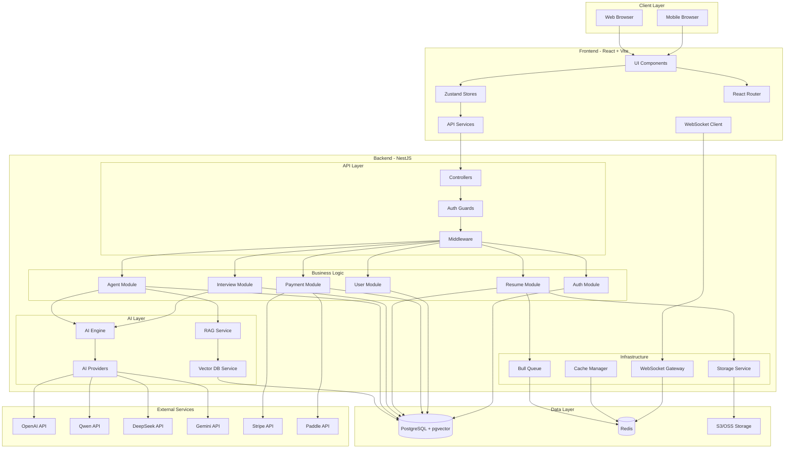
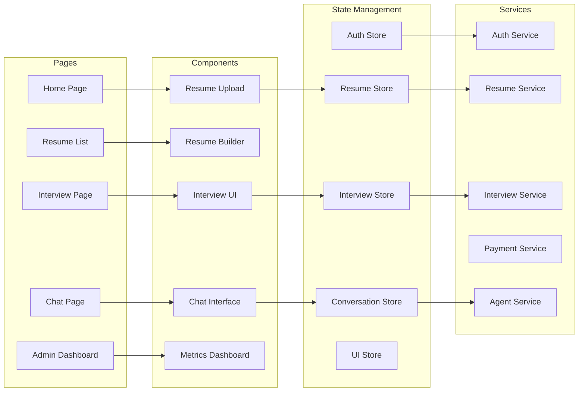
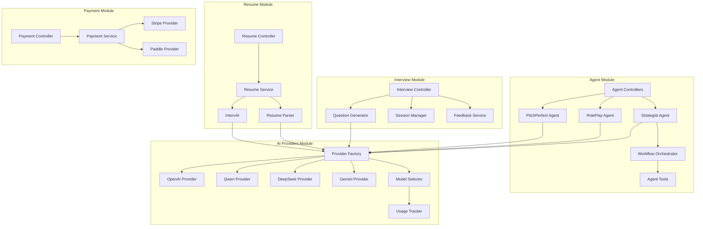
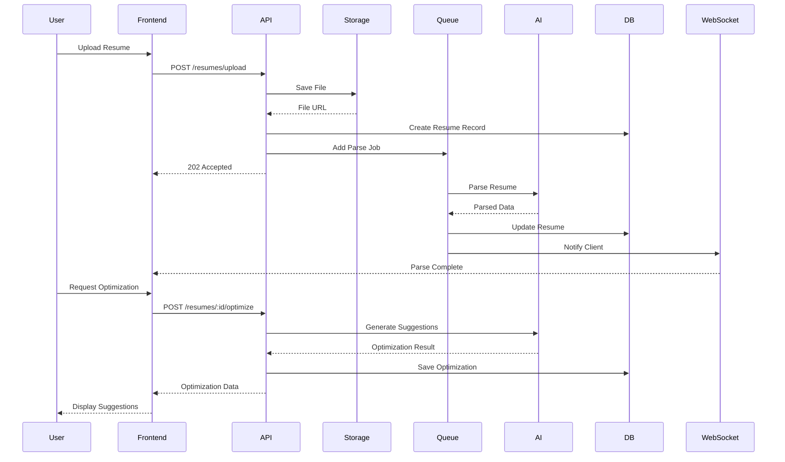
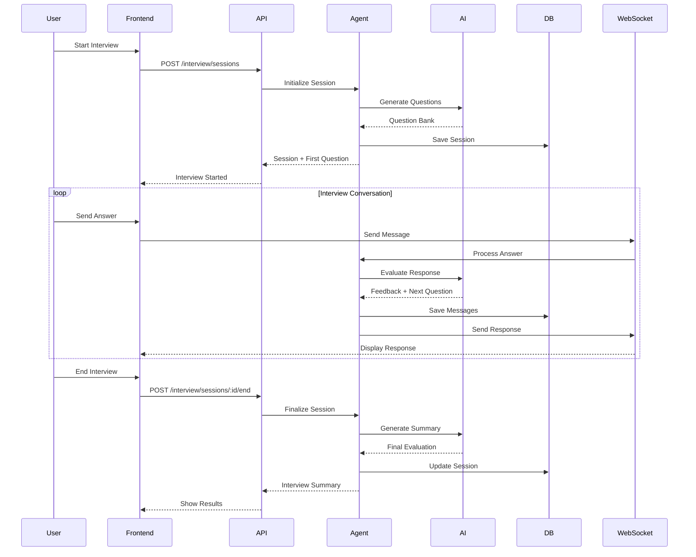
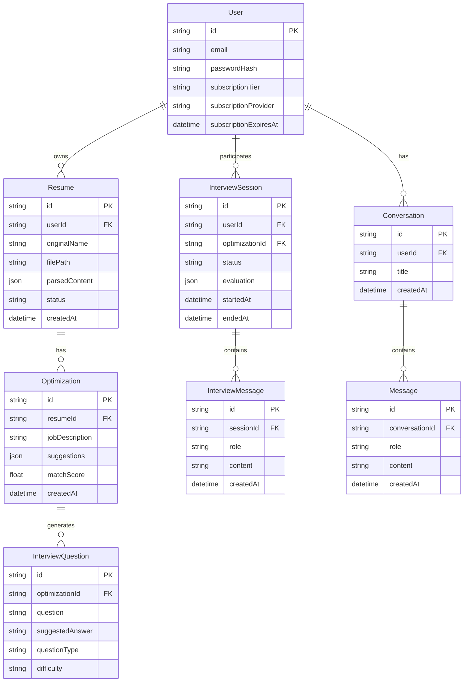
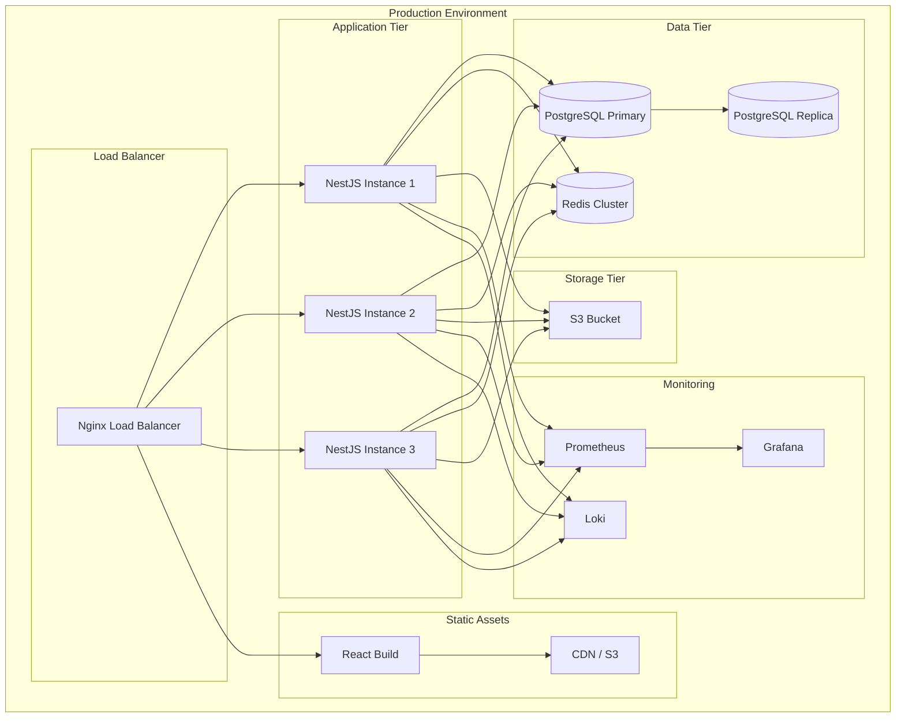
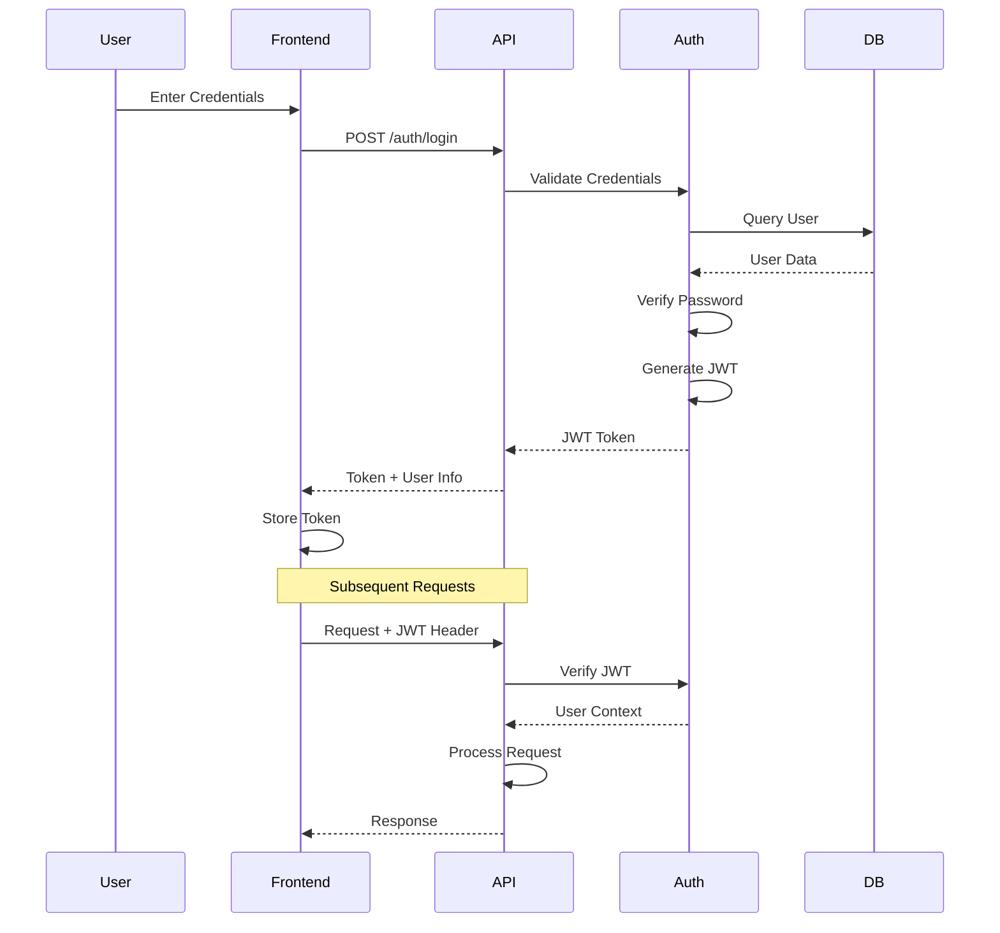
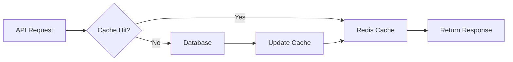

# IntervAI - System Architecture

## Overview

This document provides a comprehensive view of the system architecture, including frontend, backend, databases, caching, and AI integration layers.

## High-Level Architecture

## Component Details

### Frontend Architecture

### Backend Module Architecture

### Data Flow - Resume Upload & Optimization

### Data Flow - Mock Interview

### Database Schema (Simplified)

## Technology Stack

### Frontend

- **Framework**: React 18 + TypeScript
- **Build Tool**: Vite
- **State Management**: Zustand
- **Routing**: React Router v6
- **UI Components**: Taroify (Taro UI for H5)
- **Styling**: CSS Modules + Tailwind CSS
- **WebSocket**: Socket.io-client
- **HTTP Client**: Axios

### Backend

- **Framework**: NestJS + TypeScript
- **Runtime**: Node.js 18+
- **ORM**: Prisma
- **Queue**: Bull (Redis-based)
- **WebSocket**: Socket.io
- **Validation**: class-validator
- **Authentication**: JWT + Passport
- **File Upload**: Multer

### Databases & Storage

- **Primary Database**: PostgreSQL 14+
- **Vector Extension**: pgvector
- **Cache & Queue**: Redis 7+
- **File Storage**: S3 / Aliyun OSS / MinIO

### AI & ML

- **LLM Framework**: LangChain
- **AI Providers**:
  - OpenAI (GPT-4, GPT-3.5)
  - Alibaba Qwen
  - DeepSeek
  - Google Gemini
- **Vector Search**: pgvector
- **Embeddings**: OpenAI text-embedding-ada-002

### DevOps

- **Containerization**: Docker + Docker Compose
- **Reverse Proxy**: Nginx
- **Monitoring**: Prometheus + Grafana
- **Logging**: Winston + Loki
- **CI/CD**: GitHub Actions

## Deployment Architecture

## Security Architecture

### Authentication Flow

### Security Layers

1. **Transport Security**: HTTPS/TLS 1.3
2. **Authentication**: JWT with refresh tokens
3. **Authorization**: Role-based access control (RBAC)
4. **Input Validation**: class-validator + sanitization
5. **Rate Limiting**: Redis-based throttling
6. **CORS**: Configured whitelist
7. **SQL Injection**: Prisma parameterized queries
8. **XSS Protection**: Content Security Policy
9. **File Upload**: Type validation + virus scanning
10. **API Keys**: Encrypted storage + rotation

## Performance Optimization

### Caching Strategy

### Caching Layers

1. **Browser Cache**: Static assets (1 year)
2. **CDN Cache**: Images, CSS, JS (1 week)
3. **Redis Cache**:
   - User sessions (24 hours)
   - API responses (5 minutes)
   - AI results (1 hour)
4. **Database Query Cache**: Prisma query caching

### Queue Processing

- **Resume Parsing**: Async with Bull queue
- **AI Generation**: Rate-limited queue
- **Email Sending**: Background queue
- **Backup Tasks**: Scheduled cron jobs

## Scalability Considerations

### Horizontal Scaling

- **Stateless API**: Multiple NestJS instances
- **Session Storage**: Redis cluster
- **File Storage**: S3 (unlimited)
- **Database**: Read replicas for queries

### Vertical Scaling

- **Database**: Increase PostgreSQL resources
- **Redis**: Increase memory allocation
- **AI Processing**: GPU instances for local models

### Cost Optimization

- **AI Provider Selection**: Cost-based model routing
- **Caching**: Reduce redundant AI calls
- **CDN**: Reduce bandwidth costs
- **Database**: Connection pooling

## Monitoring & Observability

### Metrics Collected

- **Application**: Request rate, latency, errors
- **Database**: Query performance, connection pool
- **Cache**: Hit rate, memory usage
- **AI**: Token usage, cost, latency
- **Queue**: Job processing time, failure rate

### Alerting Rules

- High error rate (>5%)
- Slow response time (>2s)
- Database connection issues
- Redis memory threshold (>80%)
- AI cost threshold exceeded

## Future Architecture Enhancements

### Planned Improvements

1. **Microservices**: Split into domain services
2. **Event Sourcing**: Audit trail for all changes
3. **GraphQL**: Alternative API layer
4. **Kubernetes**: Container orchestration
5. **Multi-region**: Geographic distribution
6. **Real-time Collaboration**: Operational transformation
7. **Mobile Apps**: Native iOS/Android
8. **Offline Support**: Progressive Web App

## Conclusion

The architecture is designed for:

- **Scalability**: Horizontal and vertical scaling
- **Reliability**: Redundancy and failover
- **Performance**: Multi-layer caching
- **Security**: Defense in depth
- **Maintainability**: Modular design
- **Cost Efficiency**: Smart resource usage

The system can handle thousands of concurrent users while maintaining sub-second response times for most operations.
