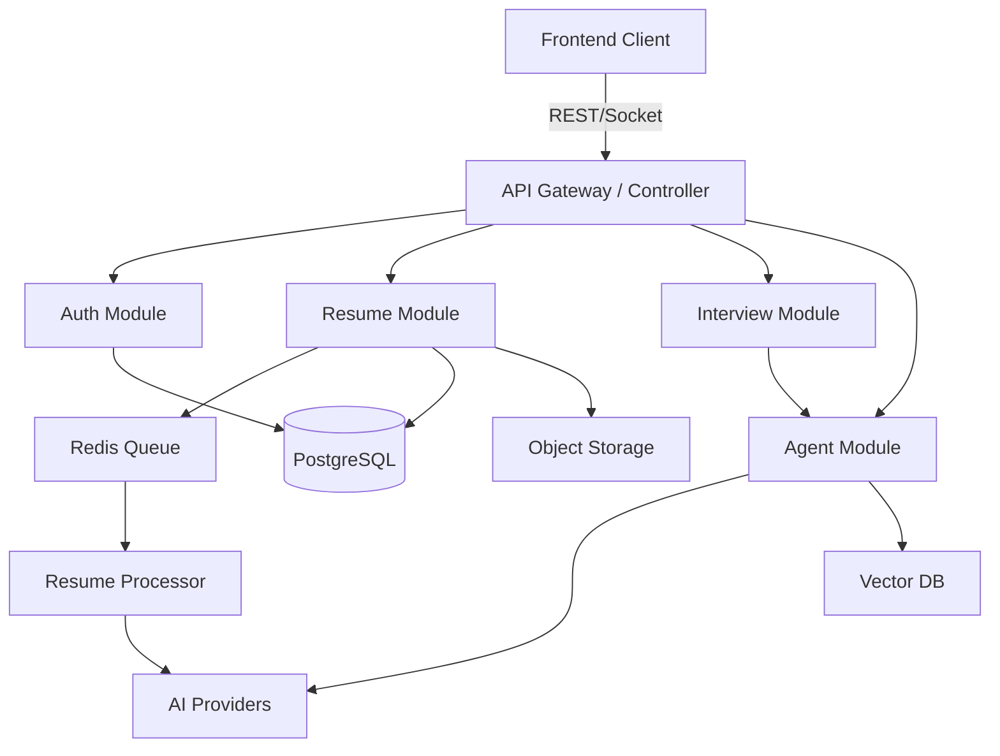

# System Architecture

## Overview

The IntervAI is a full-stack application designed to help users optimize their resumes using AI technology.

### Tech Stack

- **Frontend**: React (Vite), TypeScript, Tailwind CSS, Zustand, Shadcn UI.
- **Backend**: NestJS, TypeScript, Prisma (PostgreSQL), Bull (Redis), Better-Auth / Passport.
- **AI**: LangChain, OpenAI/DeepSeek/Qwen integrations.
- **Storage**: AWS S3 / MinIO / Local.

## High-Level Architecture

## Core Modules

### 1. Agent Module (`src/agent`)

Orchestrates AI interactions using LangChain. Supports RAG (Retrieval Augmented Generation) and multiple agent types.

### 2. Interview Module (`src/interview`)

Manages mock interview sessions.

- **Question Generator**: Creates tailored questions.
- **Session Manager**: Handles real-time chat state.

### 3. Resume Module (`src/resume`)

Handles resume parsing and optimization.

- **Parser**: Extracts structured data from PDF/DOCX.
- **Optimizer**: Generates suggestions and rewrites content.

### 4. Payment Module (`src/payment`)

Handles subscriptions and one-time payments via Stripe/Paddle.

## Database Schema

The database uses PostgreSQL managed by Prisma.

### Key Models

- **User**: Core user entity.
- **Resume**: Stores original file info and parsed JSON data.
- **Optimization**: Links Resume + Job Description -> Analysis Results.
- **Job**: Target job descriptions.
- **InterviewSession**: Stores interview state and messages.
- **InterviewQuestion**: Generated questions for a session.
- **AgentSession**: Tracks AI usage and token consumption.

For full details, see `prisma/schema.prisma`.

## Design Patterns

- **Facade Pattern**: Used in `InterviewService` to simplify complex subsystems.
- **Adapter Pattern**: Used in `AIProviders` to unify different LLM APIs.
- **Queue/Worker Pattern**: Used for long-running tasks like Resume Parsing.
